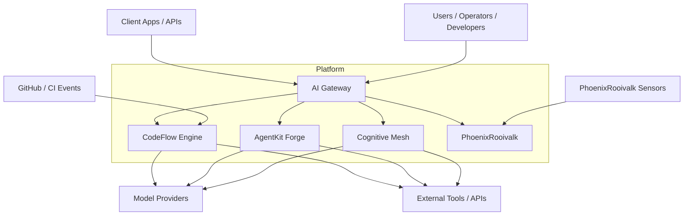

# System Context

Status: Accepted
Date: 2026-03-15
Owners: PhoenixVC Architecture Group

## Context

The PhoenixVC AI Platform integrates multiple intelligent systems designed to support:

- AI request routing and governance
- Multi-agent orchestration
- Developer workflow intelligence
- Tool-driven agent execution
- Edge telemetry interpretation

The platform consists of five major subsystems:

1. AI Gateway
2. Cognitive Mesh
3. CodeFlow Engine
4. AgentKit Forge
5. PhoenixRooivalk

These systems operate across both cloud infrastructure and edge deployments, and rely on a hybrid SLM + LLM architecture for performance, cost efficiency, and reasoning capability.

## Decision

Adopt a layered architecture where:

- AI Gateway acts as the control-plane entry point
- SLMs perform routing, triage, screening, and compression
- LLMs are used selectively for high-value reasoning
- Edge systems remain locally autonomous when necessary

## System Context Diagram

## Consequences

### Advantages

- centralized governance of AI usage
- consistent routing logic
- scalable orchestration
- edge autonomy

### Tradeoffs

- additional architectural complexity
- routing model calibration required
- shared telemetry contracts required
