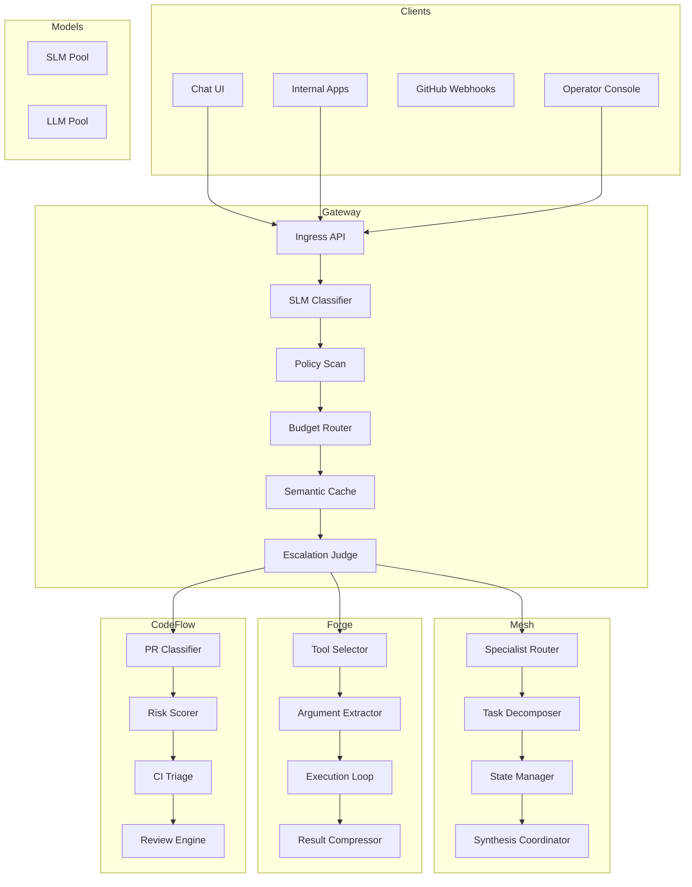

# Container Architecture

Status: Accepted
Date: 2026-03-15

## Context

To support scalability and independent evolution of system capabilities, the platform is decomposed into containerized services.

Each service is responsible for a clearly bounded domain.

## Container Diagram

## Consequences

### Benefits

- service isolation
- independent scaling
- clearer ownership

### Tradeoffs

- increased service orchestration complexity
