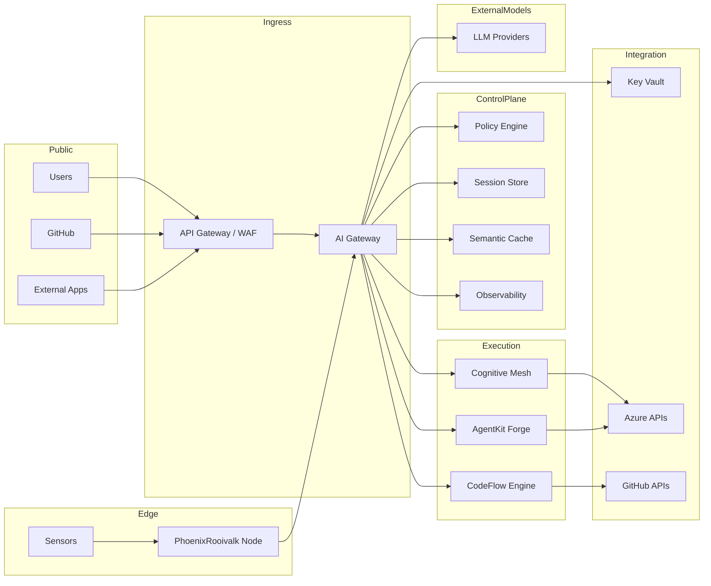

# Deployment and Trust Boundaries

Status: Accepted

## Context

The system interacts with external users, internal services, model providers, and edge devices. Clear trust boundaries must be established.

## Trust Boundary Diagram

## Security Principles

- **Gateway is the only public AI ingress.**
- **Secrets only accessed through Key Vault.**
- **Tool access occurs through controlled brokers.**
- **Edge nodes operate under constrained trust.**
