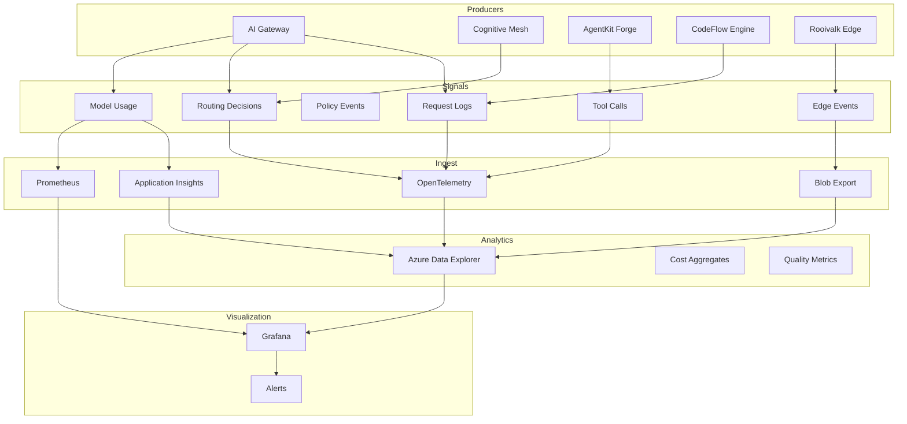

# Observability and Telemetry

Status: Accepted

## Context

Cross-system observability is required for:

- cost visibility
- routing quality measurement
- policy enforcement evidence
- debugging and operational monitoring

## Telemetry Architecture

### Telemetry Sinks

LiteLLM enables Prometheus metrics via `success_callback` and `failure_callback` containing "prometheus". The Prometheus exporter exposes a `/metrics` endpoint that scrapes application metrics. See `infra/modules/aigateway_aca/main.tf:95-113` for the container configuration.

The primary telemetry sinks are:

- **OpenTelemetry**: Traces and spans
- **Application Insights**: Azure Monitor implementation using `APPLICATIONINSIGHTS_CONNECTION_STRING` env var for OTEL exporter
- **Blob Export**: Raw event storage
- **Prometheus**: Application metrics via `/metrics` endpoint

## Retention Policies

Application Insights retention defaults:

- **Production**: 90 days
- **Non-production (dev/staging)**: 30 days

These are environment-specific settings configured in the Application Insights resource. Operators can adjust retention in the Azure Portal under Application Insights resource settings.

Include retention expectations in operational runbooks to align cost and data availability expectations.

## Key Metrics

### Gateway

- routing decision distribution
- SLM vs LLM usage ratio
- cache hit rate

### CodeFlow

- PR classification accuracy
- CI triage distribution

### AgentKit

- tool selection success rate

### Rooivalk

- alert compression ratio
- edge escalation frequency
