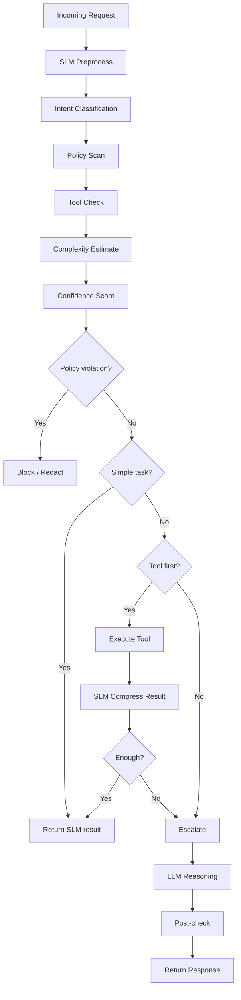

# SLM to LLM Decision Flow

Status: Accepted

## Context

Small Language Models are used as the operational cognition layer, while Large Language Models perform high-value reasoning.

## Decision Flow

## Consequences

### Benefits

- reduced inference cost
- lower latency
- improved throughput

### Risks

- incorrect routing
- model confidence calibration required
