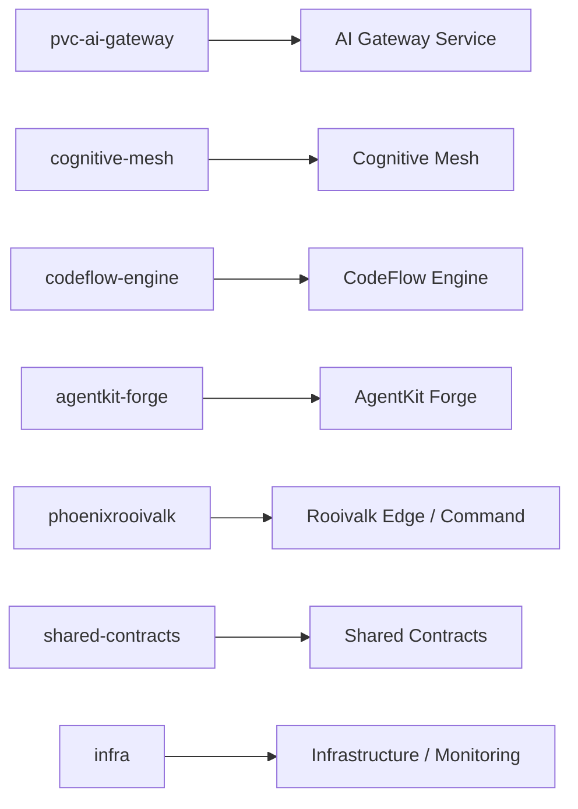

# Repository Ownership Map

Status: Accepted

## Repository Map

## Ownership

| Repository           | Owns                                                   |
| -------------------- | ------------------------------------------------------ |
| **AI Gateway**       | request routing, policy enforcement, model abstraction |
| **Cognitive Mesh**   | orchestration, multi-agent coordination                |
| **CodeFlow Engine**  | CI/CD intelligence, PR analysis                        |
| **AgentKit Forge**   | tool-driven agents, execution runtime                  |
| **PhoenixRooivalk**  | edge telemetry, operator alerts                        |
| **Shared Contracts** | telemetry schema, routing decisions, audit envelope    |
| **Infrastructure**   | Azure deployment, monitoring, networking               |
