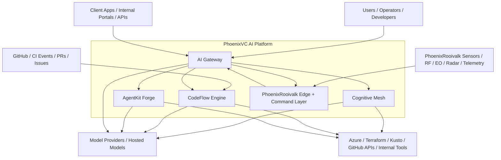
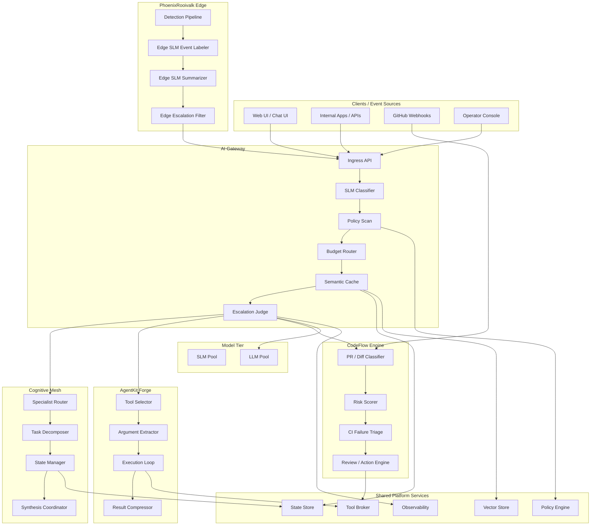
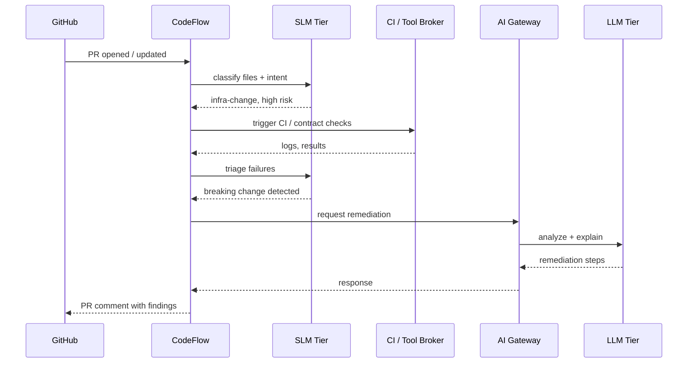
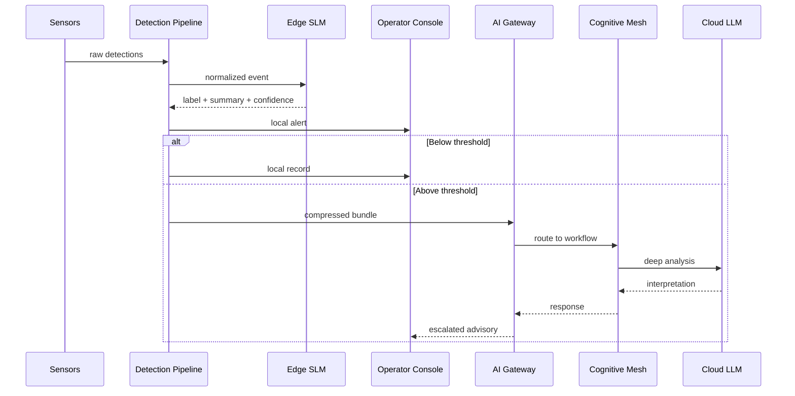

# C4-Style Architecture

This section provides C4-style diagrams showing system context, containers, and key sequences.

## 1. System Context

This shows the major external actors and the five core systems.

### External Actors

| Actor                          | Role                                       |
| ------------------------------ | ------------------------------------------ |
| Users / Operators / Developers | Initiate requests, reviews, investigations |
| Apps / APIs                    | Consume AI control plane programmatically  |
| GitHub                         | Triggers software delivery workflows       |
| Sensors                        | Produce edge telemetry                     |
| Model Providers                | Serve LLM/SLM inference                    |
| Tools                          | Execution surfaces, enterprise integration |

### System Roles

| System          | Role                                         |
| --------------- | -------------------------------------------- |
| AI Gateway      | Front door, routing, policy, budget, caching |
| Cognitive Mesh  | Multi-agent coordination and synthesis       |
| CodeFlow Engine | SDLC/CI intelligence                         |
| AgentKit Forge  | Tool-driven agent execution                  |
| PhoenixRooivalk | Edge detection interpretation                |

---

## 2. Container Diagram

### Container Responsibilities

#### AI Gateway

| Container        | Responsibility                   |
| ---------------- | -------------------------------- |
| Ingress API      | Entry point                      |
| SLM Classifier   | Intent/complexity classification |
| Policy Scan      | Safety/compliance gate           |
| Budget Router    | Tier selection                   |
| Semantic Cache   | Avoid redundant inference        |
| Escalation Judge | Small-vs-large decision          |

#### Cognitive Mesh

| Container             | Responsibility   |
| --------------------- | ---------------- |
| Specialist Router     | Picks agent(s)   |
| Task Decomposer       | Splits work      |
| State Manager         | Compressed state |
| Synthesis Coordinator | Merge + escalate |

#### AgentKit Forge

| Container          | Responsibility     |
| ------------------ | ------------------ |
| Tool Selector      | Chooses tool       |
| Argument Extractor | Structured inputs  |
| Execution Loop     | Run/retry/fallback |
| Result Compressor  | Distills output    |

#### CodeFlow Engine

| Container            | Responsibility      |
| -------------------- | ------------------- |
| PR/Diff Classifier   | File classification |
| Risk Scorer          | Risk assessment     |
| CI Failure Triage    | Failure bucketing   |
| Review/Action Engine | Routing/actions     |

#### PhoenixRooivalk Edge

| Container              | Responsibility     |
| ---------------------- | ------------------ |
| Detection Pipeline     | Signal processing  |
| Edge Event Labeler     | Labels events      |
| Edge Summarizer        | Operator summaries |
| Edge Escalation Filter | Cloud escalation   |

---

## 3. CodeFlow Sequence

### SLM Handles

- File classification
- Risk scoring
- Log bucketing
- Cause identification

### LLM Handles

- Remediation proposals
- Tradeoff explanation
- Evidence synthesis

---

## 4. PhoenixRooivalk Sequence

### Design Intent

- Label events
- Summarize meaning
- Suppress noise
- Conserve bandwidth
- Escalate only when justified

---

## 5. C4 Narrative

### System Context

The platform provides a unified AI control plane for developer workflows, agent orchestration, and edge intelligence.

### Container View

| Layer           | Description                              |
| --------------- | ---------------------------------------- |
| Control-plane   | Classification, policy, routing, caching |
| Execution       | Orchestration, tools, CI, edge           |
| Shared services | Policy, retrieval, memory, telemetry     |
| Model           | SLM and LLM workloads                    |
| Edge            | Local interpretation + escalation        |

### Dynamic Patterns

| Pattern        | System          | Description          |
| -------------- | --------------- | -------------------- |
| Gateway triage | AI Gateway      | Selective escalation |
| Repo triage    | CodeFlow        | Remediation          |
| Multi-agent    | Cognitive Mesh  | State compression    |
| Tool loops     | AgentKit Forge  | Result distillation  |
| Edge-first     | PhoenixRooivalk | Threshold escalation |
