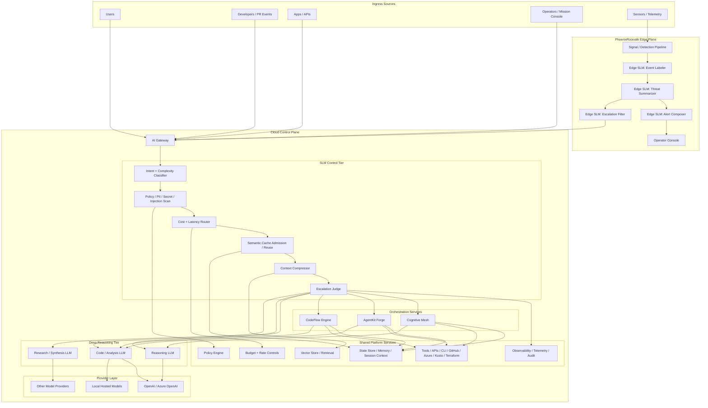
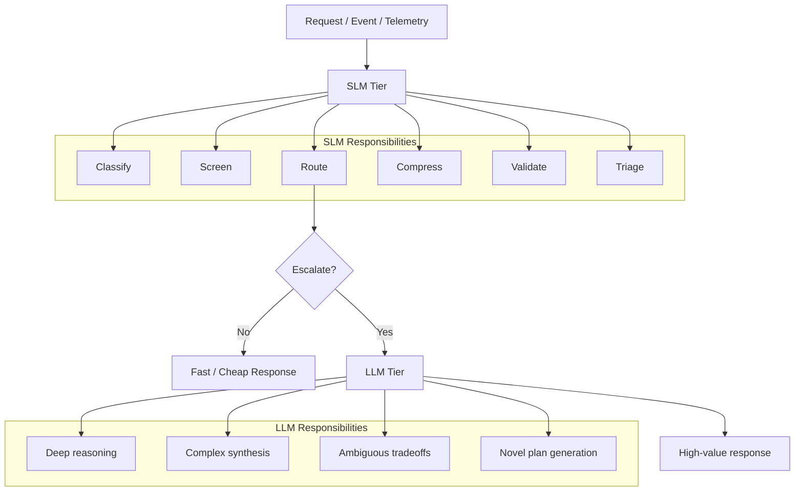
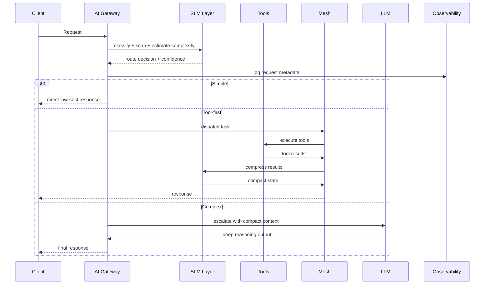
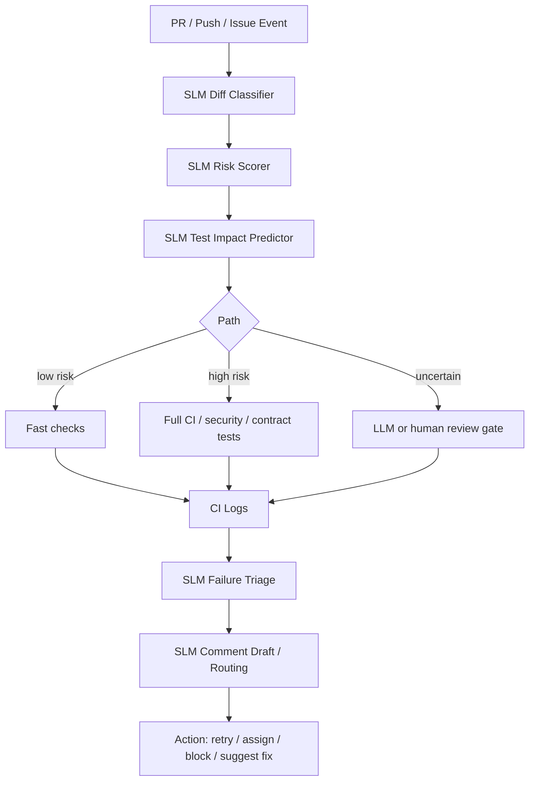
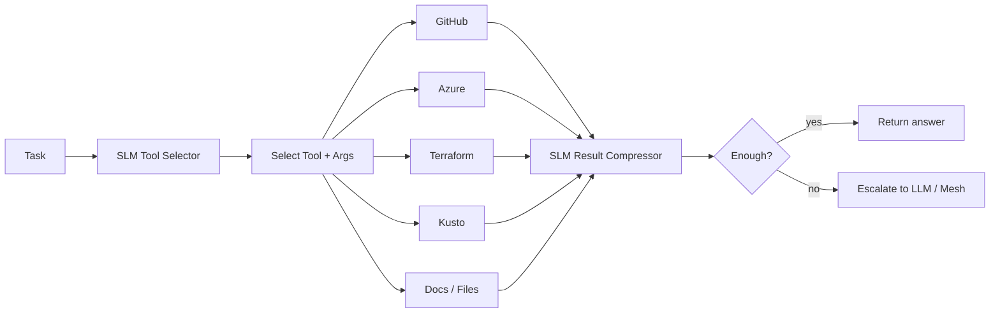
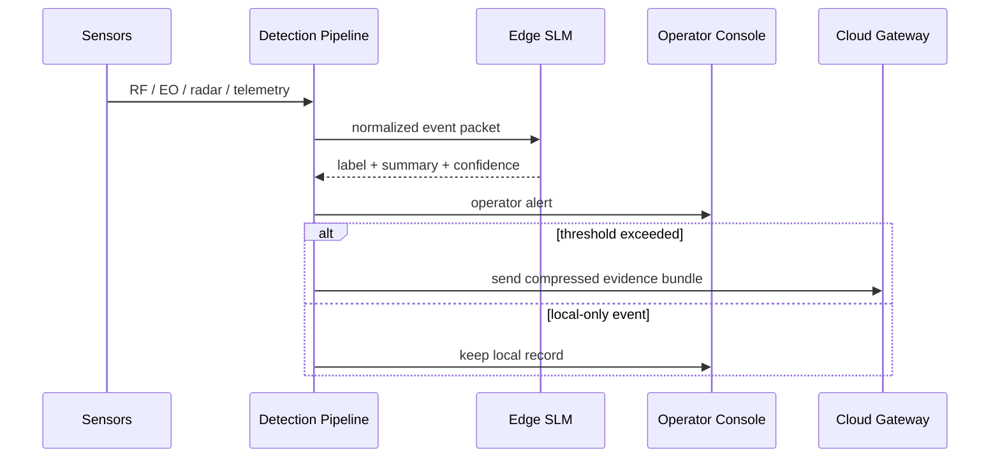

# Cross-System Architecture

This document describes the unified production architecture that separates:

- Control plane vs execution plane
- SLM tier vs LLM tier
- Cloud vs edge
- Policy, observability, cache, and cost controls

## Unified Production Architecture



## System Responsibilities

### AI Gateway

The front door that owns:

- Request intake
- Classification
- Safety checks
- Budget-aware routing
- Cache decisions
- Escalation decisions

### Cognitive Mesh

The orchestration brain for multi-agent work:

- Specialist routing
- Decomposition
- Shared state coordination

### AgentKit Forge

The tool execution runtime:

- Tool selection
- Parameter extraction
- Execution loops

### CodeFlow Engine

The CI/CD intelligence plane:

- PR/diff triage
- CI failure bucketing
- Contract breakage interpretation

### PhoenixRooivalk

The edge interpretation plane:

- Event labeling
- Operator alert generation
- Low-bandwidth summaries

---

## Control Plane vs Execution Plane

```mermaid
flowchart LR
    subgraph CP["Control Plane"]
        A[AI Gateway]
        B[SLM Routing]
        C[Policy Engine]
        D[Budget Controls]
        E[Observability]
        F[State / Memory]
    end

    subgraph EP["Execution Plane"]
        G[Cognitive Mesh]
        H[AgentKit Forge]
        I[CodeFlow Engine]
        J[LLM Providers]
        K[Tools / APIs]
        L[PhoenixRooivalk Edge]
    end

    A --> B
    B --> G
    B --> H
    B --> I
    B --> J
    G --> K
    H --> K
    I --> K
    L --> A
    C --> A
    D --> A
    E --> A
    F --> G
    F --> H
    F --> I
```



---

## SLM Tier vs LLM Tier



---

## Practical Request Path (AI Gateway)



---

## CodeFlow Engine CI Path



---

## AgentKit Forge Tool Loop



---

## PhoenixRooivalk Edge Path



---

## Layer Responsibilities

| Layer         | Primary                        | SLM Role                | LLM Role             |
| ------------- | ------------------------------ | ----------------------- | -------------------- |
| Edge          | PhoenixRooivalk                | Reports only            | None                 |
| Gateway       | AI Gateway                     | Routing, security, cost | Complex reasoning    |
| Orchestration | Cognitive Mesh, AgentKit Forge | Routing, tools          | Synthesis            |
| Intelligence  | CodeFlow Engine                | Triage                  | None                 |
| Synthesis     | LLM Layer                      | None                    | Reasoning, synthesis |

---

## Ownership Boundaries

### AI Gateway owns

- Ingress control
- Policy enforcement
- Routing
- Cost governance
- Model/provider abstraction
- Shared telemetry

### Cognitive Mesh owns

- Multi-agent coordination
- Task decomposition
- State fusion
- Escalation into deep synthesis

### AgentKit Forge owns

- Tool loops
- Action execution
- Extraction
- Retry/fallback behavior

### CodeFlow Engine owns

- Software delivery intelligence
- Repo event interpretation
- CI analysis
- Developer feedback automation

### PhoenixRooivalk owns

- Edge summarization
- Local alerting
- Compressed event escalation

---

## Implementation Phases

### Phase 1 — Gateway-first

Build SLM control plane: intent classifier, policy scanner, budget router, cache gate, escalation judge

### Phase 2 — CodeFlow Engine

Add SLMs: diff classifier, PR risk scorer, CI failure bucketer

### Phase 3 — AgentKit Forge

Optimize tool loops: tool selector, arg extractor, result compressor

### Phase 4 — Cognitive Mesh

Add: specialist router, decomposer, state manager

### Phase 5 — PhoenixRooivalk

Deploy edge SLMs: event label, alert text, escalation filter

---

## Shared Telemetry Schema

```json
{
  "trace_id": "uuid",
  "system": "ai-gateway|cognitive-mesh|codeflow-engine|agentkit-forge|phoenixrooivalk",
  "stage": "classify|route|tool_call|llm_escalation|edge_alert",
  "model_tier": "slm|llm",
  "model_name": "example-model",
  "decision": "allow|block|tool_first|escalate|local_only",
  "confidence": 0.92,
  "latency_ms": 83,
  "token_in": 540,
  "token_out": 96,
  "estimated_cost": 0.0014,
  "policy_flags": ["pii:none", "secret:none"],
  "outcome": "success"
}
```

---

## Production Rules

### Escalate to LLM when:

- Confidence below threshold
- Ambiguity above threshold
- Multiple specialists disagree
- Tool results conflict
- Output is user-facing and high-stakes
- Architecture/tradeoff reasoning required

### Stay in SLM path when:

- Task is classification
- Task is screening
- Task is extraction
- Task is summarization
- Task is repetitive CI triage
- Task is edge-local operator support

---

## C4-Style Architecture

For detailed C4-style diagrams including:

- System Context diagram
- Container diagram
- CodeFlow sequence
- PhoenixRooivalk edge-to-cloud sequence

See [c4-architecture.md](c4-architecture.md)

---

## Bottom Line

The most practical target architecture:

- **AI Gateway** as the centralized SLM control plane
- **Cognitive Mesh / AgentKit Forge / CodeFlow Engine** as execution systems
- **PhoenixRooivalk** as edge plane with local SLM autonomy
- **LLMs** reserved for synthesis, ambiguity, and hard reasoning

> Gateway governs. SLMs triage and steer. Specialist systems execute. LLMs arbitrate the hard cases. Edge stays local unless escalation is justified.
