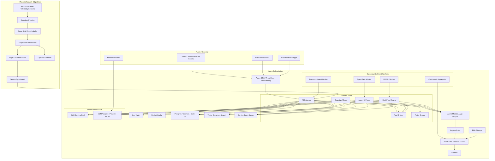
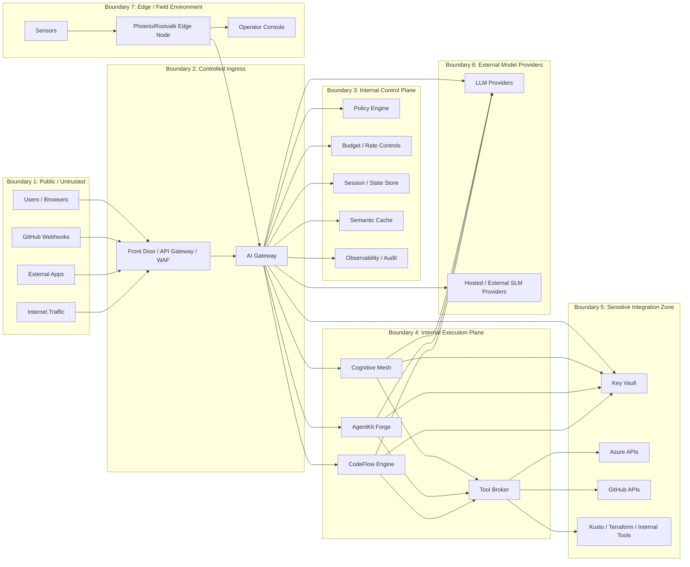
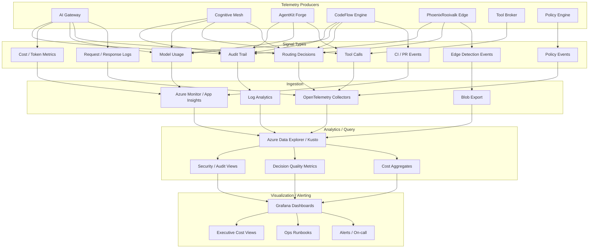

# Deployment, Trust Boundaries & Observability

This set extends the C4 view into operational architecture including deployment, security boundaries, and telemetry.

---

## 1. Deployment Diagram

This is the practical cloud/edge deployment shape for your stack.

### Practical Reading of Deployment

| Zone                 | Components                                                | Purpose                 |
| -------------------- | --------------------------------------------------------- | ----------------------- |
| **Front door**       | Azure DNS / Front Door / App Gateway                      | Ingress and routing     |
| **Shared backing**   | Key Vault, Redis, Postgres/Cosmos, AI Search, Service Bus | State, caching, secrets |
| **Runtime services** | AI Gateway, Cognitive Mesh, AgentKit Forge, CodeFlow      | Core execution          |
| **Workers**          | PR/CI, Agent Task, Telemetry, Cost Aggregators            | Background processing   |
| **Model zone**       | SLM Pool, LLM Adapter                                     | AI inference            |
| **Edge**             | Detection Pipeline, Edge SLMs, Operator Console           | Local operation         |

---

## 2. Trust Boundary Diagram

This is the security-relevant segmentation.

### Security Interpretation

| Boundary  | Description                                                                               |
| --------- | ----------------------------------------------------------------------------------------- |
| **1 → 2** | Treat all inbound as hostile until authenticated, rate-limited, schema-validated, logged  |
| **2 → 3** | AI Gateway is the only entry into internal AI control plane                               |
| **3 → 4** | Control-plane services decide policy, routing, cost, escalation                           |
| **4 → 5** | Sensitive zone: credentials, infra mutation, production APIs, write actions               |
| **6**     | External providers are semi-trusted - apply output scanning and redaction                 |
| **7**     | Edge nodes are partially disconnected - need signed software, local audit, encrypted sync |

---

## 3. Observability Architecture

This is the unified telemetry design across all systems.

### What to Measure

#### Gateway metrics

- Requests by route
- SLM vs LLM escalation rate
- Confidence distribution
- Token in/out averages
- Semantic cache hit rate
- Refusal/block counts
- Provider latency/error rate

#### Cognitive Mesh metrics

- Route-to-specialist distribution
- Decomposition count per task
- Summary compression ratio
- Multi-agent disagreement rate
- Escalation rate to LLM synthesis

#### AgentKit Forge metrics

- Tool selection accuracy
- Retry counts
- Fallback frequency
- Avg tool-loop depth
- Tool output compression ratio

#### CodeFlow Engine metrics

- PR classification distribution
- False positive/negative on risk tier
- CI failure bucket frequency
- Contract-break detection precision
- Comment usefulness feedback

#### PhoenixRooivalk metrics

- Local-only vs escalated events
- Edge summary latency
- Alert volume per session
- Signal-to-alert compression ratio
- Dropped/deferred syncs
