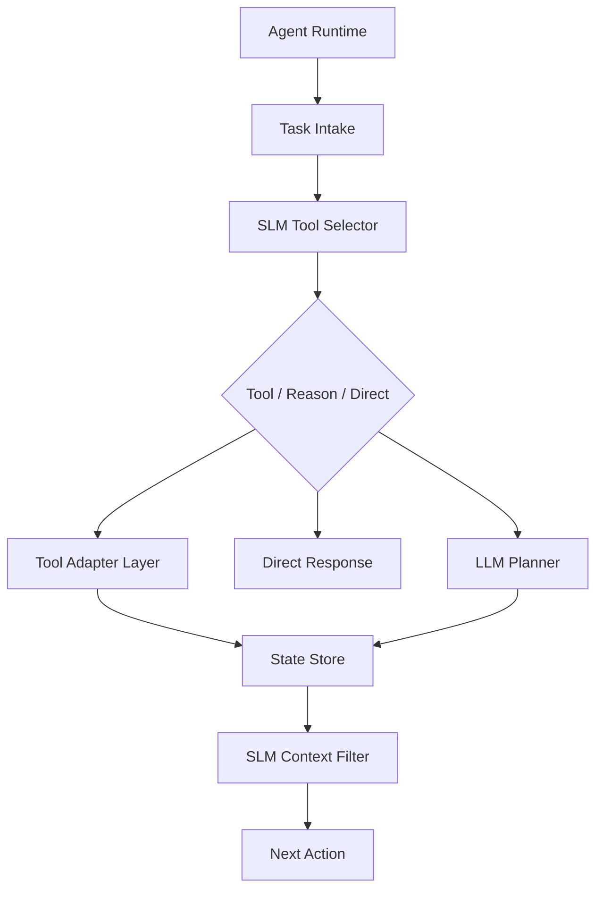

# AgentKit Forge SLM Implementation

## SLM Endpoints

| Endpoint                | Method | Purpose                                           |
| ----------------------- | ------ | ------------------------------------------------- |
| `/slm/select-tool`      | POST   | Maps request to GitHub/Azure/Terraform/Kusto/docs |
| `/slm/filter-context`   | POST   | Selects only relevant memory/state                |
| `/slm/estimate-budget`  | POST   | Predicts steps, token tier, tool-first viability  |
| `/slm/check-escalation` | POST   | Decides whether LLM planning is needed            |

## Service Boundaries



## Example Responses

**select-tool:**

```json
{
  "action_mode": "tool",
  "tool": "azure_cli",
  "operation_family": "cost_management",
  "arguments_hint": { "service": "foundry", "time_window": "last_30_days" },
  "confidence": 0.89
}
```

**estimate-budget:**

```json
{
  "predicted_steps": 4,
  "token_cost_tier": "medium",
  "tool_first_recommended": true,
  "llm_needed": false,
  "confidence": 0.81
}
```

## Contract Shapes

```typescript
interface SelectToolOutput {
  action_mode: "tool" | "reason" | "direct";
  tool: "github" | "azure_cli" | "terraform" | "kusto" | "docs_search";
  operation_family: string;
  arguments_hint: Record<string, unknown>;
  confidence: number;
}

interface EstimateBudgetOutput {
  predicted_steps: number;
  token_cost_tier: "low" | "medium" | "high";
  tool_first_recommended: boolean;
  llm_needed: boolean;
  confidence: number;
}
```

## Telemetry Fields

| Field               | Type    | Description        |
| ------------------- | ------- | ------------------ |
| `agent_run_id`      | uuid    | Unique run ID      |
| `selected_tool`     | string  | Tool selected      |
| `action_mode`       | string  | tool/reason/direct |
| `budget_tier`       | string  | Cost tier          |
| `predicted_steps`   | number  | Steps predicted    |
| `escalated_to_llm`  | boolean | LLM invoked        |
| `compression_ratio` | number  | Context reduced    |

## Fallback Rules

| Condition                     | Action                      |
| ----------------------------- | --------------------------- |
| No tool confidence >= 0.80    | Don't execute automatically |
| Context filter low            | Preserve more context       |
| Budget low but ambiguity high | Escalate to planner         |
| Tool failure                  | Classify before retry       |

## Configurable Thresholds

```typescript
const DEFAULT_THRESHOLDS = {
  tool_selection: { direct_execute: 0.85, require_confirm: 0.7 },
  context_filtering: { aggressive: 0.85, conservative: 0.78 },
  escalation_check: { continue_tools: 0.8, llm_planning: 0.65 },
  budget_estimate: { reliable: 0.75, uncertain: 0.6 },
};
```

| Threshold | Action               |
| --------- | -------------------- |
| >= 0.85   | Direct execution     |
| 0.70-0.84 | Require confirmation |
| < 0.70    | Decline / clarify    |
