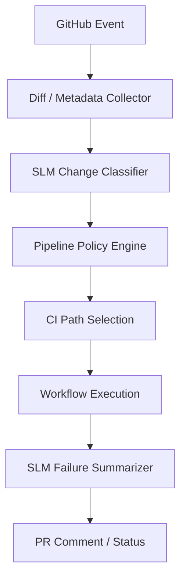

# CodeFlow Engine SLM Implementation

## SLM Endpoints

| Endpoint                     | Method | Purpose                                                         |
| ---------------------------- | ------ | --------------------------------------------------------------- |
| `/slm/classify-change`       | POST   | Determines: docs/code/config/infra/security, risk, blast radius |
| `/slm/suggest-pipeline`      | POST   | Fast path vs full path                                          |
| `/slm/summarize-failure`     | POST   | Turns CI output into actionable summary                         |
| `/slm/release-note-fragment` | POST   | Generates structured change summary                             |

## Service Boundaries



## Example Responses

**classify-change:**

```json
{
  "change_type": "infra",
  "risk": "high",
  "blast_radius": "shared_environment",
  "requires_contract_validation": false,
  "requires_security_scan": true,
  "recommended_pipeline": "full",
  "confidence": 0.91
}
```

**summarize-failure:**

```json
{
  "failure_type": "test_failure",
  "subtype": "integration_environment",
  "retryable": true,
  "summary": "Integration tests failed due to unreachable dependent service.",
  "recommended_next_action": "retry once and verify service container health",
  "confidence": 0.83
}
```

## Contract Shapes

```typescript
interface ClassifyChangeOutput {
  change_type: "docs" | "code" | "config" | "schema" | "infra" | "security";
  risk: "low" | "medium" | "high" | "critical";
  blast_radius: "local_only" | "shared_environment" | "production";
  requires_security_scan: boolean;
  recommended_pipeline: "fast" | "full";
  confidence: number;
}

interface SummarizeFailureOutput {
  failure_type: string;
  retryable: boolean;
  summary: string;
  recommended_next_action: string;
  confidence: number;
}
```

## Telemetry Fields

| Field                           | Type   | Description         |
| ------------------------------- | ------ | ------------------- |
| `repo`                          | string | Repository          |
| `pr_number`                     | number | PR number           |
| `change_type`                   | string | Classified type     |
| `risk`                          | string | Risk level          |
| `pipeline_selected`             | string | Path chosen         |
| `slm_classification_latency_ms` | number | Classification time |
| `workflow_duration_ms`          | number | Total duration      |

## Fallback Rules

| Condition                           | Action                               |
| ----------------------------------- | ------------------------------------ |
| Never skip mandatory tests from SLM | Hard policy enforcement              |
| High-risk + low confidence          | Choose stricter pipeline             |
| Classifier unavailable              | Default conservative path            |
| Failure uncertain                   | No destructive reruns without policy |

## Configurable Thresholds

```typescript
const DEFAULT_THRESHOLDS = {
  change_classification: { direct_use: 0.88, manual_review: 0.75 },
  pipeline_suggestion: { direct_path: 0.85, force_full_path: 0.7 },
  failure_summary: { direct_use: 0.8, require_human: 0.65 },
};
```

| Threshold | Action            |
| --------- | ----------------- |
| >= 0.88   | Direct use        |
| 0.75-0.87 | Verify with rules |
| < 0.75    | Manual review     |
