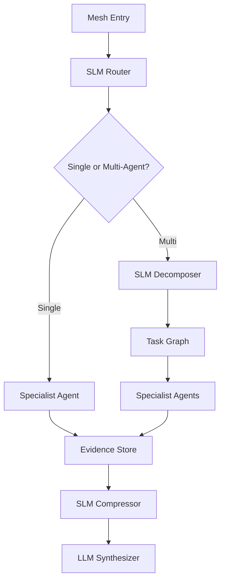

# Cognitive Mesh SLM Implementation

## SLM Endpoints

| Endpoint                 | Method | Purpose                                     |
| ------------------------ | ------ | ------------------------------------------- |
| `/slm/decompose-task`    | POST   | Break complex request into agent tasks      |
| `/slm/route-agent`       | POST   | Route task to appropriate specialist agent  |
| `/slm/compress-context`  | POST   | Compress long context for agent consumption |
| `/slm/validate-response` | POST   | Validate agent response coherence           |

## Service Boundaries



## Example Responses

**route-agent:**

```json
{
  "mode": "multi_agent",
  "agents": ["infra_agent", "cost_agent", "security_agent"],
  "priority": "normal",
  "reason_codes": ["azure", "cost", "security_terms"],
  "confidence": 0.87
}
```

**decompose-task:**

```json
{
  "subtasks": [
    { "id": "t1", "agent": "infra_agent", "goal": "inventory deployed Azure resources" },
    { "id": "t2", "agent": "cost_agent", "goal": "identify cost spikes" },
    { "id": "t3", "agent": "security_agent", "goal": "check for unauthorized usage" }
  ],
  "confidence": 0.82
}
```

## Contract Shapes

```typescript
interface RouteAgentOutput {
  target_agent: string;
  mode: "single_agent" | "parallel_agents" | "sequential";
  escalation_required: boolean;
  fallback_agent?: string;
  confidence: number;
}

interface DecomposeTaskOutput {
  tasks: {
    id: string;
    description: string;
    agent_type: string;
    dependencies: string[];
  }[];
  estimated_complexity: "low" | "medium" | "high";
  confidence: number;
}
```

## Telemetry Fields

| Field                 | Type     | Description         |
| --------------------- | -------- | ------------------- |
| `mesh_run_id`         | uuid     | Unique execution ID |
| `route_mode`          | string   | single/multi agent  |
| `selected_agents`     | string[] | Agents selected     |
| `decomposition_count` | number   | Subtasks created    |
| `compression_ratio`   | number   | Tokens reduced      |
| `escalated_to_llm`    | boolean  | LLM used            |

## Fallback Rules

| Condition            | Action                    |
| -------------------- | ------------------------- |
| Route confidence low | Send to orchestration LLM |
| Decomposition low    | Single-agent fallback     |
| Compression low      | Pass fuller context       |
| No agent matches     | Default to "research"     |

## Configurable Thresholds

```typescript
const DEFAULT_THRESHOLDS = {
  agent_routing: { direct_route: 0.85, verify_with_rules: 0.7 },
  task_decomposition: { direct_decompose: 0.8, single_agent_fallback: 0.65 },
  context_compression: { aggressive: 0.85, conservative: 0.78 },
};
```

| Threshold | Action            |
| --------- | ----------------- |
| >= 0.85   | Direct routing    |
| 0.70-0.84 | Verify with rules |
| < 0.70    | Escalate to LLM   |
