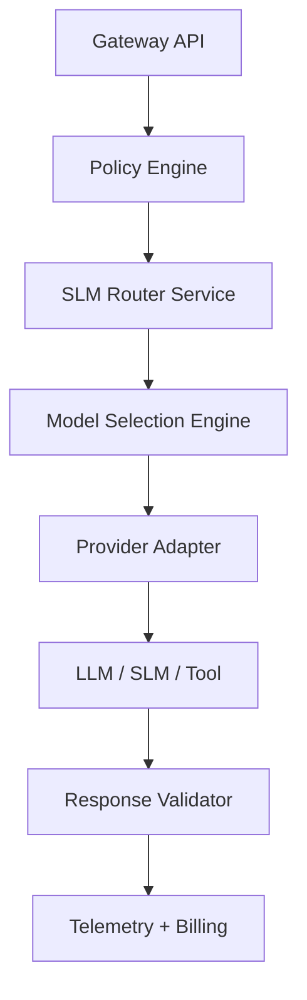

# AI Gateway SLM Implementation

## SLM Endpoints

| Endpoint                 | Method | Purpose                                               |
| ------------------------ | ------ | ----------------------------------------------------- |
| `/slm/classify-request`  | POST   | Infer intent, estimate complexity, detect toolability |
| `/slm/policy-screen`     | POST   | PII/secrets/prompt injection scan, tenant policy fit  |
| `/slm/post-tag-response` | POST   | Normalize telemetry tags, classify business category  |

## Service Boundaries



## Example Request/Response

**Request:**

```json
{
  "tenant_id": "phoenixvc-prod",
  "user_input": "Review this PR and tell me if the API contract changed.",
  "context": {
    "channel": "web",
    "has_files": true,
    "history_len": 7
  }
}
```

**Response:**

```json
{
  "intent": "code_review",
  "complexity": "medium",
  "tool_candidate": true,
  "recommended_target": "codeflow-engine",
  "recommended_model_tier": "small",
  "escalation_required": false,
  "confidence": 0.93
}
```

## Contract Shapes

```typescript
interface ClassifyRequestOutput {
  request_id: string;
  label: "code_review" | "chat" | "analysis" | "tool_invocation" | "embedding";
  confidence: number;
  complexity: "low" | "medium" | "high";
  tool_candidate: boolean;
  recommended_tier: "slm" | "small" | "large";
  cacheable: boolean;
}

interface PolicyScreenOutput {
  allowed: boolean;
  risk_level: "low" | "medium" | "high" | "critical";
  risk_categories: string[];
  action: "allow" | "rewrite" | "block" | "escalate";
  confidence: number;
}
```

## Telemetry Fields

| Field               | Type    | Description         |
| ------------------- | ------- | ------------------- |
| `tenant_id`         | string  | Tenant identifier   |
| `slm_latency_ms`    | number  | SLM processing time |
| `intent`            | string  | Classified intent   |
| `complexity`        | string  | Complexity level    |
| `risk_level`        | string  | Risk assessment     |
| `tool_candidate`    | boolean | Tool recommendation |
| `escalated_to_llm`  | boolean | Whether escalated   |
| `cost_estimate_usd` | number  | Estimated cost      |

## Fallback Rules

| Condition                        | Action                 |
| -------------------------------- | ---------------------- |
| `policy-screen.allowed == false` | Block or redact        |
| `confidence < 0.70`              | Escalate to LLM        |
| Tool suggested but no mapping    | Send to general LLM    |
| Tagging fails                    | Mark telemetry partial |

## Configurable Thresholds

```typescript
const DEFAULT_THRESHOLDS = {
  intent_classification: { direct_route: 0.9, verify_with_rules: 0.75 },
  policy: { block_immediately: ["critical_secrets"], escalate_to_review: 0.6 },
};
```

| Threshold | Action            |
| --------- | ----------------- |
| >= 0.90   | Direct routing    |
| 0.75-0.89 | Verify with rules |
| < 0.75    | Escalate to LLM   |
