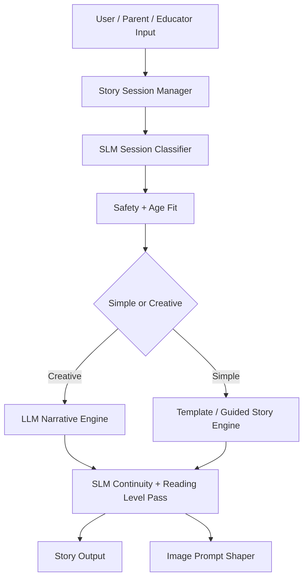

# Mystira SLM Implementation

## SLM Endpoints

| Endpoint                     | Method | Purpose                                                          |
| ---------------------------- | ------ | ---------------------------------------------------------------- |
| `/slm/classify-session`      | POST   | Determines: bedtime/educational/adventure/branching/continuation |
| `/slm/check-safety-agefit`   | POST   | Ensures age appropriateness, tone, blocked content               |
| `/slm/check-continuity`      | POST   | Maintains character consistency, world rules                     |
| `/slm/shape-image-prompt`    | POST   | Converts story scene to safe, style-consistent prompt            |
| `/slm/compress-story-memory` | POST   | Keeps only relevant story state                                  |

## Service Boundaries



## Example Responses

**check-safety-agefit:**

```json
{
  "allowed": true,
  "age_band": "8-10",
  "tone": "gentle_adventure",
  "rewrite_needed": false,
  "blocked_categories": [],
  "confidence": 0.94
}
```

**check-continuity:**

```json
{
  "consistent": true,
  "issues": [],
  "retained_story_facts": [
    "main character is Luma",
    "forest companion is a silver fox",
    "setting is moonlit valley"
  ],
  "confidence": 0.86
}
```

**shape-image-prompt:**

```json
{
  "prompt": "A child-safe illustrated moonlit valley scene with Luma and a silver fox, soft wonder, readable composition, no frightening imagery.",
  "safety_checked": true,
  "style_profile": "mystira_storybook_v1",
  "confidence": 0.9
}
```

## Contract Shapes

```typescript
interface ClassifySessionOutput {
  story_type: "bedtime" | "educational" | "adventure" | "branching" | "continuation";
  age_band: string;
  is_interactive: boolean;
  needs_images: boolean;
  curriculum_tags: string[];
  confidence: number;
}

interface CheckSafetyAgefitOutput {
  allowed: boolean;
  age_band: string;
  tone: string;
  rewrite_needed: boolean;
  blocked_categories: string[];
  confidence: number;
}

interface ShapeImagePromptOutput {
  prompt: string;
  safety_checked: boolean;
  style_profile: string;
  confidence: number;
}
```

## Telemetry Fields

| Field                   | Type    | Description      |
| ----------------------- | ------- | ---------------- |
| `session_id`            | uuid    | Session ID       |
| `story_mode`            | string  | Classification   |
| `age_band`              | string  | Target age       |
| `safety_action`         | string  | Action taken     |
| `rewrite_applied`       | boolean | Rewritten        |
| `continuity_check_used` | boolean | Validated        |
| `image_prompt_shaped`   | boolean | Prompt generated |
| `slm_cost`              | number  | SLM cost         |
| `llm_cost`              | number  | LLM cost         |

## Fallback Rules

| Condition          | Action                   |
| ------------------ | ------------------------ |
| Safety uncertainty | Safe rewrite or refuse   |
| Continuity low     | Pass more history to LLM |
| Image shaping low  | Conservative template    |
| Age-fit uncertain  | Default younger-safe     |

## Configurable Thresholds

```typescript
const DEFAULT_THRESHOLDS = {
  session_classification: { direct_use: 0.88, require_review: 0.75 },
  safety_agefit: { direct_allow: 0.92, require_rewrite: 0.8, block: 0.8 },
  continuity: { direct_use: 0.82, pass_to_llm: 0.7 },
  image_prompt: { direct_use: 0.88, conservative: 0.75 },
};
```

| Threshold | Action        |
| --------- | ------------- |
| >= 0.92   | Direct allow  |
| 0.80-0.91 | Rewrite/adapt |
| < 0.80    | Block content |
