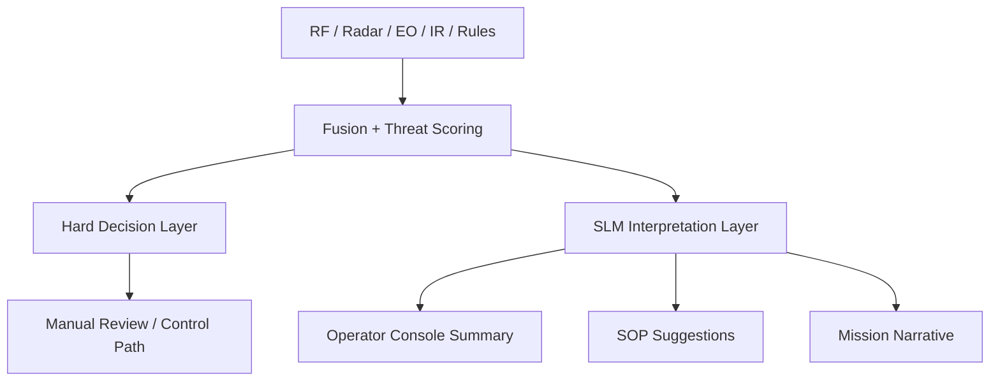

# PhoenixRooivalk SLM Implementation

## SLM Endpoints

| Endpoint                        | Method | Purpose                                              |
| ------------------------------- | ------ | ---------------------------------------------------- |
| `/slm/interpret-event`          | POST   | Turns fused detection into operator-readable summary |
| `/slm/suggest-sop`              | POST   | Maps event type to likely SOP references             |
| `/slm/condense-mission-log`     | POST   | Produces incident record                             |
| `/slm/classify-incident-report` | POST   | Creates structured post-event label set              |

## Service Boundaries



## CRITICAL: SLM is for Reporting Only

```text
┌─────────────────────────────────────────────────────────┐
│                   IMPORTANT - SAFETY BOUNDARY            │
├─────────────────────────────────────────────────────────┤
│  Hard Decision Layer must NOT depend on free-form SLM   │
│                                                         │
│  SLM output is for OBSERVATION and REPORTING only:     │
│  • Operator summaries                                   │
│  • SOP suggestions (non-binding)                       │
│  • Mission log condensation                             │
│                                                         │
│  SLM must NEVER be used for:                           │
│  • Autonomous threat response                          │
│  • Access control decisions                            │
│  • Resource isolation actions                          │
│  • Any kinetic or hard control actions                 │
└─────────────────────────────────────────────────────────┘
```

## Example Responses

**interpret-event:**

```json
{
  "title": "Low-altitude inbound contact",
  "facts": ["sector north-east", "altitude 35m", "consumer quadcopter RF profile"],
  "inferences": ["possible perimeter reconnaissance"],
  "operator_summary": "Inbound low-altitude contact detected from north-east sector.",
  "confidence": 0.77
}
```

**suggest-sop:**

```json
{
  "recommended_sops": ["SOP-12 Verify EO feed", "SOP-21 Raise perimeter alert state"],
  "confidence": 0.74
}
```

## Contract Shapes

```typescript
interface InterpretEventOutput {
  title: string;
  facts: string[];
  inferences: string[];
  operator_summary: string;
  confidence: number;
}

interface SuggestSopOutput {
  recommended_sops: string[];
  confidence: number;
}
```

## Telemetry Fields

| Field                     | Type     | Description        |
| ------------------------- | -------- | ------------------ |
| `incident_id`             | uuid     | Incident ID        |
| `sensor_fusion_version`   | string   | Fusion version     |
| `threat_score`            | number   | Calculated score   |
| `slm_interpretation_used` | boolean  | SLM invoked        |
| `sop_suggestions`         | string[] | SOPs suggested     |
| `human_acknowledged`      | boolean  | Human acknowledged |
| `offline_mode`            | boolean  | Offline mode       |

## Fallback Rules

| Condition                     | Action                       |
| ----------------------------- | ---------------------------- |
| Interpretation low confidence | Show facts only              |
| SOP low confidence            | "Manual SOP lookup required" |
| Edge model unavailable        | Use non-LLM summaries        |
| SOP generated                 | NEVER pass to control path   |

## Configurable Thresholds

```typescript
const DEFAULT_THRESHOLDS = {
  operator_summary: { direct_use: 0.8, facts_only: 0.65 },
  sop_suggestion: { direct_suggest: 0.8, manual_lookup: 0.65 },
};
```

| Threshold | Action                       |
| --------- | ---------------------------- |
| >= 0.80   | Full summary with inferences |
| 0.65-0.79 | Facts only, no inferences    |
| < 0.65    | Human analysis               |
