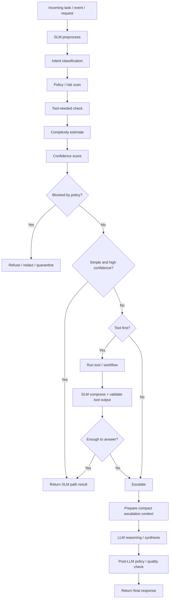
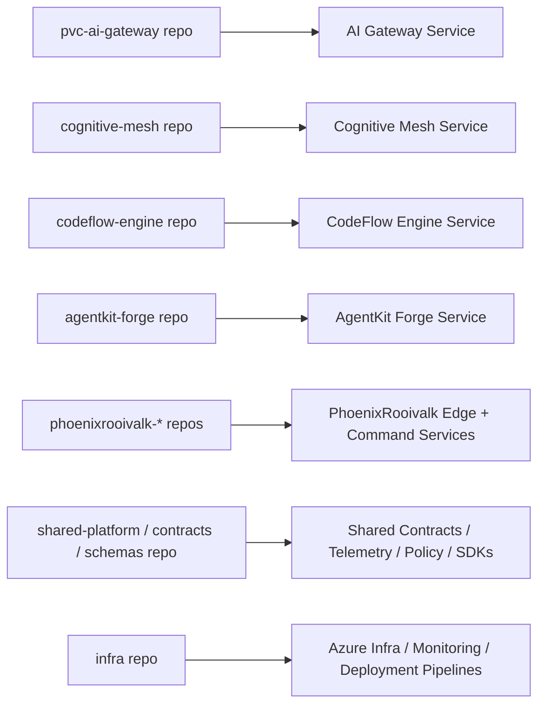

# Operations Patterns

Operational patterns including SLM→LLM decision flows, ownership maps, and implementation guidance.

---

## SLM → LLM Decision Flow

Production handoff logic for routing between SLM and LLM tiers.



### Threshold Guidelines

Use configurable thresholds, not hardcoded logic.

| Stay in SLM Path                    | Escalate to LLM            |
| ----------------------------------- | -------------------------- |
| High confidence                     | Confidence below threshold |
| Classification/extraction/screening | Policy ambiguity exists    |
| Short, bounded output               | Tool outputs conflict      |
| Unambiguous tool result             | Multi-agent disagreement   |
| Low risk                            | User-facing, high impact   |

### Decision Schema

```json
{
  "intent": "ci_failure_triage",
  "risk_level": "medium",
  "needs_tool": true,
  "complexity": "medium",
  "confidence": 0.81,
  "policy_status": "allow",
  "recommended_path": "tool_first",
  "escalate": false
}
```

---

## Repo-to-Service Ownership Map

Maps conceptual stack into likely repo/service boundaries.



### Ownership Summary

| Repo                   | Owns                                                                                                    |
| ---------------------- | ------------------------------------------------------------------------------------------------------- |
| **pvc-ai-gateway**     | Ingress API, routing contracts, escalation policy, provider abstraction, semantic cache, audit envelope |
| **cognitive-mesh**     | Specialist routing, task decomposition, agent state model, synthesis orchestration, disagreement logic  |
| **codeflow-engine**    | PR event models, diff classification, CI log triage, contract break workflows, comment generation       |
| **agentkit-forge**     | Tool registry, tool selection schemas, arg extraction, execution-loop state, retry/fallback logic       |
| **phoenixrooivalk-\*** | Edge event schema, local alerting, escalation packet format, command-layer integration                  |
| **shared-platform**    | Telemetry envelope, routing decision schema, model usage schema, audit/trace IDs, reusable schemas      |
| **infra**              | Azure deployment, Grafana/ADX dashboards, Key Vault wiring, service identities, networking              |

---

## Implementation Order

### First

Define shared contracts:

- Routing decision schema
- Model usage event
- Tool execution event
- Audit envelope
- Edge escalation packet

### Second

Implement telemetry in the gateway:

- Trace ID propagation
- Decision logs
- Provider usage events
- Cost estimation fields

### Third

Bring CodeFlow and AgentKit onto same telemetry envelope.

### Fourth

Add Cognitive Mesh orchestration and disagreement telemetry.

### Fifth

Add Rooivalk edge packet telemetry and sync audit.

---

## Architectural Recommendation

For your environment, the strongest production stance is:

1. **AI Gateway is the only public AI ingress**
2. **All routing decisions emit one shared RoutingDecision contract**
3. **All model calls emit one shared ModelUsageEvent**
4. **All tool invocations flow through a broker or shared event schema**
5. **All edge escalations use compact evidence packets**
6. **ADX/Kusto + Grafana becomes the operational truth layer**

This gives you:

- Cost visibility
- Quality visibility
- Compliance evidence
- Easier A/B testing of SLM routing
- Cleaner failure diagnosis
