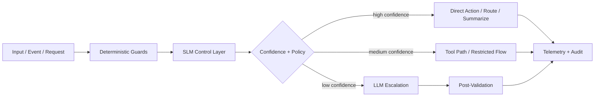
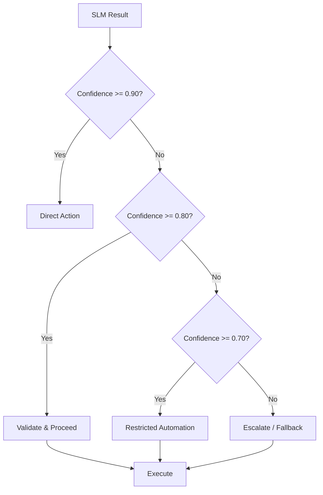

# SLM Implementation Matrix

This document provides a repo-by-repo implementation matrix showing SLM endpoints, contract shapes, telemetry fields, fallback rules, confidence thresholds, and practical service boundaries across all six platforms.

## Quick Reference

| Platform        | SLM Role                                | Key Endpoints                             |
| --------------- | --------------------------------------- | ----------------------------------------- |
| AI Gateway      | routing, policy, cost control           | /classify-request, /policy-screen         |
| Cognitive Mesh  | agent routing, decomposition            | /route-agent, /decompose-task             |
| CodeFlow Engine | PR triage, failure analysis             | /classify-change, /summarize-failure      |
| AgentKit Forge  | tool selection, context shaping         | /select-tool, /estimate-budget            |
| PhoenixRooivalk | event interpretation, SOP suggestions   | /interpret-event, /suggest-sop            |
| Mystira         | story safety, continuity, image prompts | /check-safety-agefit, /shape-image-prompt |

## Documentation Structure

```text
reference/
├── slm-implementation-matrix.md      # This file
├── matrix-gateway.md                  # AI Gateway details
├── matrix-cognitive-mesh.md          # Cognitive Mesh details
├── matrix-codeflow.md                 # CodeFlow Engine details
├── matrix-agentkit.md                 # AgentKit Forge details
├── matrix-rooivalk.md                # PhoenixRooivalk details
└── matrix-mystira.md                 # Mystira details
```

---

## 1. Cross-Stack Operating Model

Use the same control pattern everywhere:



---

## 2. Canonical SLM Service Interfaces

These are the reusable interface families standardized across the stack.

### A. Classification Contract

```json
{
  "request_id": "uuid",
  "label": "code_review",
  "confidence": 0.91,
  "secondary_labels": ["security_review"],
  "reason_codes": ["contains_diff", "contains_code_terms"],
  "recommended_action": "route_security_agent"
}
```

### B. Routing Contract

```json
{
  "request_id": "uuid",
  "target": "infra_agent",
  "mode": "single_agent",
  "escalation_required": false,
  "tool_candidate": true,
  "cost_tier": "low",
  "confidence": 0.88
}
```

### C. Compression Contract

```json
{
  "request_id": "uuid",
  "summary": "User wants Azure cost anomaly investigation for Foundry usage.",
  "retained_facts": [
    "resource deleted on 2026-03-05",
    "billing visible from 2026-03-03",
    "suspected partner local usage"
  ],
  "dropped_categories": ["small talk", "repeated screenshots"],
  "confidence": 0.84
}
```

### D. Safety / Moderation Contract

```json
{
  "request_id": "uuid",
  "allowed": true,
  "risk_level": "low",
  "risk_categories": [],
  "action": "allow",
  "confidence": 0.96
}
```

### E. Summarization / Operator Brief Contract

```json
{
  "request_id": "uuid",
  "title": "Possible perimeter drone approach",
  "summary": "Low-altitude approach detected from north-east sector.",
  "facts": ["altitude 35m", "entry vector north-east", "rf profile matched consumer quadcopter"],
  "inferences": ["possible surveillance behavior"],
  "recommended_next_step": "verify EO feed and initiate SOP-12",
  "confidence": 0.79
}
```

---

## 3. Cross-Platform Confidence Policy

A unified confidence policy across all platforms:

| Confidence | Meaning           | Action                                    |
| ---------- | ----------------- | ----------------------------------------- |
| 0.90-1.00  | Strong confidence | Direct automated route/action             |
| 0.80-0.89  | Acceptable        | Automate with validation                  |
| 0.70-0.79  | Uncertain         | Restricted automation or human/LLM assist |
| < 0.70     | Weak              | Escalate or safe fallback                 |



---

## 4. Cross-Platform Telemetry Schema

Use a common event envelope across all repos:

```json
{
  "event_id": "uuid",
  "timestamp_utc": "2026-03-15T10:00:00Z",
  "platform": "codeflow-engine",
  "component": "slm-change-classifier",
  "model": "phi-3-mini",
  "operation": "classify-change",
  "latency_ms": 42,
  "input_tokens": 612,
  "output_tokens": 87,
  "confidence": 0.91,
  "action_taken": "full_pipeline",
  "escalated": false,
  "cost_estimate_usd": 0.0004,
  "trace_id": "trace-123"
}
```

### Recommended Common Fields

| Field               | Type    | Description              |
| ------------------- | ------- | ------------------------ |
| `event_id`          | uuid    | Unique event identifier  |
| `trace_id`          | uuid    | Distributed trace ID     |
| `platform`          | string  | System name              |
| `component`         | string  | Specific component       |
| `operation`         | string  | Operation performed      |
| `model`             | string  | Model used               |
| `model_version`     | string  | Model version            |
| `latency_ms`        | number  | Processing time          |
| `input_tokens`      | number  | Input token count        |
| `output_tokens`     | number  | Output token count       |
| `confidence`        | number  | Model confidence         |
| `action_taken`      | string  | Action taken             |
| `escalated`         | boolean | Whether escalated to LLM |
| `fallback_reason`   | string  | Fallback reason          |
| `cost_estimate_usd` | number  | Estimated cost           |
| `tenant_or_project` | string  | Tenant identifier        |
| `environment`       | string  | Environment              |

---

## 5. Recommended Model-Role Mapping

This is a practical role map, not a vendor mandate.

| Role                    | Recommended Model Profile             |
| ----------------------- | ------------------------------------- |
| Classification          | Very small, fast instruct model       |
| Routing                 | Small instruct model with strict JSON |
| Safety Prefilter        | Small model + deterministic rules     |
| Compression             | Small/medium model with schema output |
| Failure Summarization   | Small instruct model                  |
| Creative Storytelling   | Larger narrative-capable model        |
| Deep Synthesis          | Larger reasoning model                |
| Edge Operator Summaries | Compact on-device model               |

---

## 6. Implementation Order

### Phase 1: Foundation

- AI Gateway request classifier
- CodeFlow change classifier
- AgentKit tool selector

### Phase 2: Expansion

- Cognitive Mesh router + decomposer
- Mystira safety/continuity layer

### Phase 3: Maturation

- PhoenixRooivalk operator interpreter
- Shared telemetry normalization
- Confidence calibration dashboards

---

## 7. Cross-System Summary

### Confidence Threshold Summary

| System          | High (direct) | Medium (verify) | Low (escalate) |
| --------------- | ------------- | --------------- | -------------- |
| AI Gateway      | >= 0.90       | 0.75-0.89       | < 0.75         |
| Cognitive Mesh  | >= 0.85       | 0.70-0.84       | < 0.70         |
| CodeFlow        | >= 0.88       | 0.75-0.87       | < 0.75         |
| AgentKit Forge  | >= 0.85       | 0.70-0.84       | < 0.70         |
| PhoenixRooivalk | >= 0.80       | 0.65-0.79       | < 0.65         |
| Mystira         | >= 0.92       | 0.80-0.91       | < 0.80         |

### Standard Fallback Pattern

```text
1. SLM timeout → Deterministic rules
2. Low confidence → LLM escalation
3. Safety critical → Block immediately
4. Unknown classification → Safe default
5. All failures → Log + alert + human review
```
