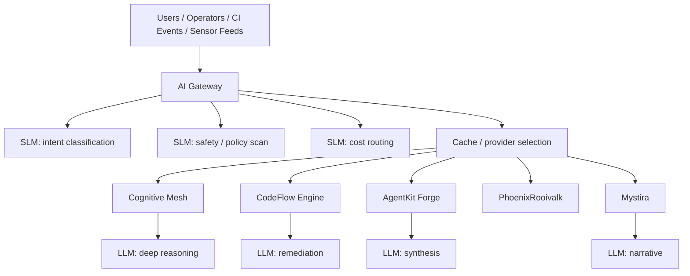

# Why SLMs Matter in These Systems

This document explains the strategic value of Small Language Models (SLMs) across the ecosystem.

## Executive Summary

Across all six platforms, SLMs provide:

| Benefit                    | Description                                 |
| -------------------------- | ------------------------------------------- |
| **Cost Control**           | Large models are invoked only when required |
| **Latency Reduction**      | Routing decisions happen in milliseconds    |
| **Edge Deployment**        | PhoenixRooivalk can run inference locally   |
| **Deterministic Behavior** | SLMs are easier to constrain and audit      |

## Summary Table

| System          | SLM Role                                |
| --------------- | --------------------------------------- |
| AI Gateway      | routing, policy checks, cost prediction |
| Cognitive Mesh  | agent routing, task decomposition       |
| PhoenixRooivalk | edge telemetry analysis                 |
| CodeFlow Engine | CI intelligence, log analysis           |
| AgentKit Forge  | tool selection, context compression     |
| Mystira         | story safety, continuity, age-fit       |

---

## Design Principle

The best use of SLMs is not "replace the big model." It is:

| Principle                | Description                                                    |
| ------------------------ | -------------------------------------------------------------- |
| **Screen First**         | SLMs handle initial classification before expensive operations |
| **Route Cheap**          | Direct simple requests to SLMs or small models                 |
| **Escalate Selectively** | Only invoke LLMs for complex, ambiguous tasks                  |
| **Compress Context**     | SLMs reduce token volume before LLM processing                 |
| **Keep Edge Local**      | PhoenixRooivalk operates without cloud dependency              |

---

## Reference Architecture

---

## Strategic Recommendation

SLMs should be treated as:

- **Control-plane intelligence**: Routing, classification, decision-making
- **Cheap operational cognition**: Fast, repetitive tasks
- **First-pass classifiers**: Initial triage before expensive operations
- **Context reducers**: Compressing data for efficient processing
- **Edge interpreters**: Local processing without cloud dependency

**Not** as replacements for the reasoning tier.

> **SLMs run the flow. LLMs solve the hard parts.**
