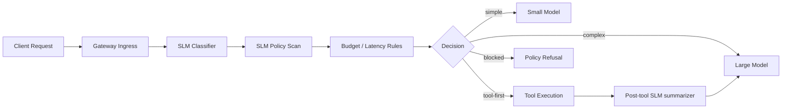

# AI Gateway — Practical SLM Use Cases

AI Gateway is the highest-leverage place to put SLMs because every request passes through it.

## Best-Fit SLM Tasks

### A. Intent and Complexity Classification

The SLM predicts:

- Request type
- Risk level
- Likely tool need
- Token size estimate
- Recommended model tier

```json
{
  "intent": "repo_analysis",
  "complexity": "medium",
  "tool_required": true,
  "security_risk": "low",
  "recommended_tier": "mid"
}
```

### B. Safety and Data-Boundary Screening

Before a request hits an expensive model:

- Secret leakage scan
- PII detection
- Jailbreak/prompt-injection detection
- Tenant/policy checks
- Outbound data classification

### C. Budget-Aware Routing

Use the SLM to decide:

- Direct answer with small model
- Call tool first
- Escalate to reasoning model
- Deny or redact
- Cache hit / semantic cache reuse

## Practical Gateway Flow



## Why It Fits AI Gateway

| Benefits                      | Tradeoffs                              |
| ----------------------------- | -------------------------------------- |
| Major cost reduction          | Misrouting risk if classifier is weak  |
| Faster median latency         | Extra hop in pipeline                  |
| Consistent policy enforcement | Need calibration, thresholds, fallback |
| Cleaner observability         |                                        |

## Where It Breaks Down

- Vague prompts
- Multi-domain prompts
- Hidden tool requirements
- Requests where complexity is not obvious

## Recommended Pattern

Use the SLM as a **triage layer, not the final authority**. If confidence is low, escalate automatically.

### Threshold Guide

| Confidence | Action            |
| ---------- | ----------------- |
| >= 0.90    | Direct routing    |
| 0.75-0.89  | Verify with rules |
| < 0.75     | Escalate to LLM   |
