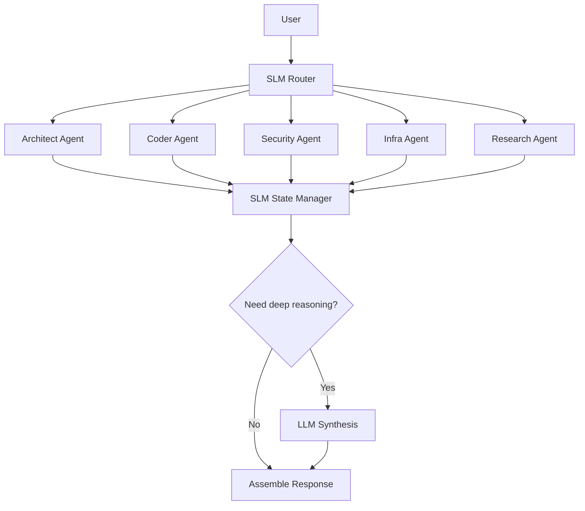

# Cognitive Mesh — Practical SLM Use Cases

Cognitive Mesh is where SLMs become orchestration primitives.

## Best-Fit SLM Tasks

### A. Specialist Routing

The SLM decides which node gets the task:

- infra
- code
- security
- research
- finance
- documentation
- architecture

### B. Task Decomposition

Before invoking expensive reasoning, the SLM splits tasks into atomic units.

Example: "Review this repo and propose a deploy plan" becomes:

1. Detect stack
2. Detect infra
3. Detect secrets/compliance issues
4. Map CI/CD
5. Draft deploy sequence

### C. State Summarization

Multi-agent systems accumulate long histories. An SLM maintains:

- Current objective
- Known constraints
- Prior decisions
- Unresolved blockers
- Tool outputs summary

### D. Agent Health and Loop Detection

The SLM can classify:

- Repeated retries
- Tool thrashing
- No-progress loops
- Conflicting agent outputs

## Practical Cognitive Mesh Flow

## Why It Fits Cognitive Mesh

| Benefits              | Tradeoffs                     |
| --------------------- | ----------------------------- |
| Cheaper orchestration | Decomposition quality matters |
| Faster routing        | Errors compound downstream    |
| Smaller context       | Summaries can lose nuance     |
| Better determinism    |                               |

## Best Operational Pattern

| Use SLMs For             | Use LLMs For            |
| ------------------------ | ----------------------- |
| "Who should do this?"    | Final synthesis         |
| "What is the next step?" | Architecture evaluation |
| "What matters here?"     | Novel reasoning         |
| "Are we stuck?"          |                         |

## Threshold Guide

| Confidence | Action            |
| ---------- | ----------------- |
| >= 0.85    | Direct routing    |
| 0.70-0.84  | Verify with rules |
| < 0.70     | Escalate to LLM   |
