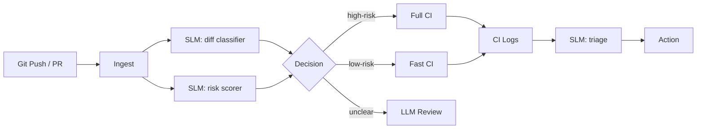

# CodeFlow Engine — Practical SLM Use Cases

CodeFlow Engine is one of the strongest SLM domains because CI/CD workloads are repetitive, structured, and high-volume.

## Best-Fit SLM Tasks

### A. PR Classification

Classify a PR as:

- docs-only
- low-risk refactor
- dependency update
- infra change
- security-sensitive
- contract-breaking
- test-only
- release-impacting

### B. Diff Summarization

Generate short structured summaries from git diff and changed files.

### C. CI Failure Triage

Classify failures into:

- test regression
- flaky test
- dependency resolution
- auth/secret issue
- infra provisioning error
- timeout/resource exhaustion
- lint/type failure

### D. Review Routing

Decide which reviewers or agent flows should be triggered.

### E. Release-Note Extraction

Extract user-facing change notes without using a full LLM.

## Practical CodeFlow Pipeline

## Why It Fits CodeFlow Engine

| Benefits                   | Tradeoffs                   |
| -------------------------- | --------------------------- |
| Huge cost savings at scale | False negatives possible    |
| Strong consistency         | Requires designed schemas   |
| Better PR throughput       | Model drift affects quality |
| Repetitive workload fit    |                             |

## Strongest SLM Opportunities

Given emphasis on contract diffs, OpenAPI breakage, schema validation, CI gates:

- Change intent detection
- Docs generation hints
- Issue bucketing
- Runbook suggestion
- Log compression before escalation

## Threshold Guide

| Confidence | Action            |
| ---------- | ----------------- |
| >= 0.88    | Direct use        |
| 0.75-0.87  | Verify with rules |
| < 0.75     | Manual review     |
