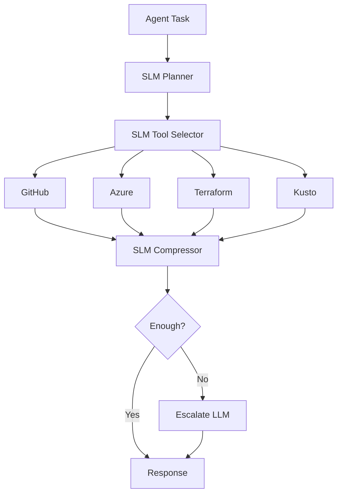

# AgentKit Forge — Practical SLM Use Cases

AgentKit Forge is ideal for SLMs because tool-heavy agents don't need a large model for every micro-decision.

## Best-Fit SLM Tasks

### A. Tool Selection

Choose among:

- GitHub API
- Azure CLI
- Terraform
- Kusto
- File retrieval
- Documentation lookup
- Shell command
- Search

### B. Parameter Extraction

Pull structured arguments out of the request before calling the tool.

### C. Context Compression

Convert long tool traces into compact operational state.

### D. Step Validation

Check whether a step result is sufficient before moving to next step.

### E. Retry / Fallback Logic

Classify whether an error merits:

- Retry
- Alternate tool
- Human intervention
- Escalation to larger model

## Practical AgentKit Flow

## Why It Fits AgentKit Forge

| Benefits             | Tradeoffs                   |
| -------------------- | --------------------------- |
| Lower token burn     | Brittle if schemas weak     |
| Faster tool loops    | Poor extraction = bad calls |
| Improved determinism | Compression can lose detail |
| Cleaner contracts    |                             |

## Design Rule

| Let SLMs Own | Let LLMs Own         |
| ------------ | -------------------- |
| Selection    | Synthesis            |
| Extraction   | Ambiguity resolution |
| Compression  | Multi-tool planning  |
| Validation   |                      |

## Threshold Guide

| Confidence | Action               |
| ---------- | -------------------- |
| >= 0.85    | Direct execution     |
| 0.70-0.84  | Require confirmation |
| < 0.70     | Decline / clarify    |
