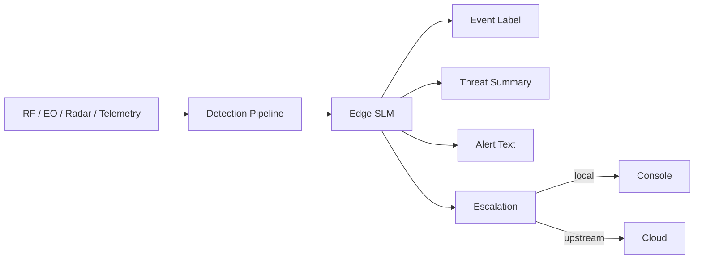

# PhoenixRooivalk — Practical SLM Use Cases

PhoenixRooivalk is different because the core advantage is locality, latency, and resilience—not just cost.

## Best-Fit SLM Tasks

### A. Edge Event Labeling

Convert telemetry into categories:

- loitering
- fast ingress
- signal loss
- RF anomaly
- perimeter breach candidate
- operator attention required

### B. Operator-Facing Summary

Turn noisy sensor events into concise, human-readable alerts.

### C. Log-to-Report Conversion

Mission logs, detections, and post-event evidence can be summarized locally.

### D. Escalation Gating

Only send selected events to cloud when:

- Confidence above threshold
- Event duration exceeds threshold
- Evidence bundle sufficient
- Bandwidth available

## Practical Edge Flow

## Why It Fits PhoenixRooivalk

| Benefits                 | Tradeoffs                 |
| ------------------------ | ------------------------- |
| Low latency              | Limited reasoning depth   |
| Offline capability       | Edge hardware constraints |
| Bandwidth savings        | Must handle noisy inputs  |
| Privacy / sovereignty    | Needs tight prompt design |
| Constrained hardware fit |                           |

## CRITICAL: Important Boundary

Do NOT let SLM become sole authority for kinetic or high-stakes decisions.

| Use SLM For      | NOT For                      |
| ---------------- | ---------------------------- |
| Interpretation   | Critical threat adjudication |
| Summarization    | Response triggering          |
| Prioritization   | Access control               |
| Operator support | Resource isolation           |

## Threshold Guide

| Confidence | Action         |
| ---------- | -------------- |
| >= 0.80    | Full summary   |
| 0.65-0.79  | Facts only     |
| < 0.65     | Human analysis |
