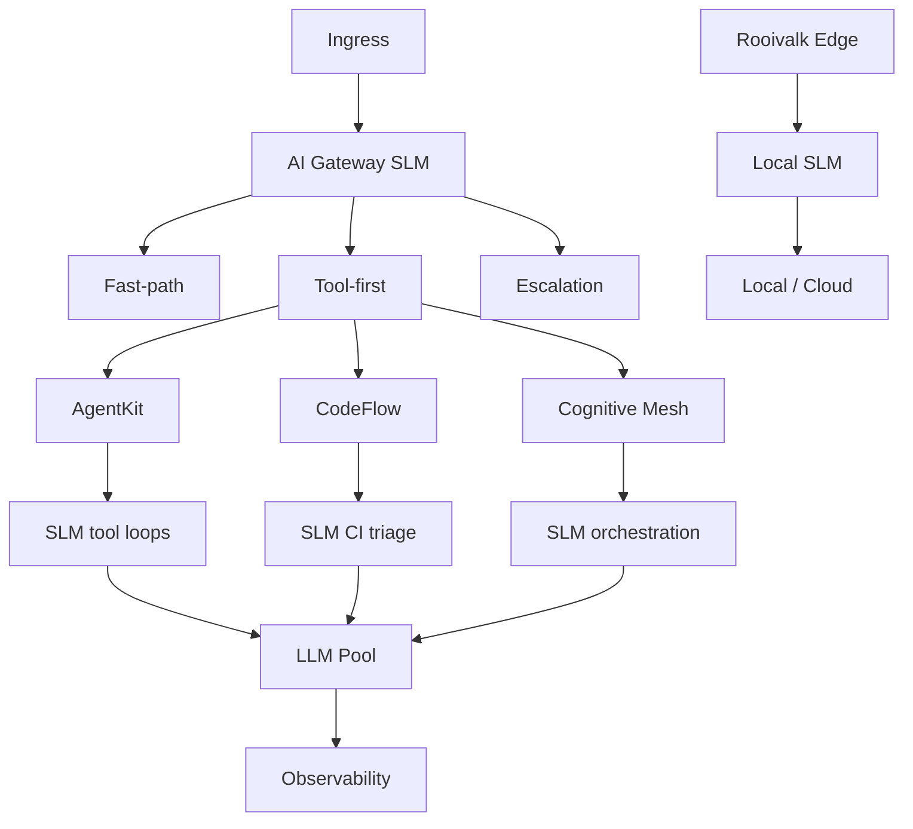
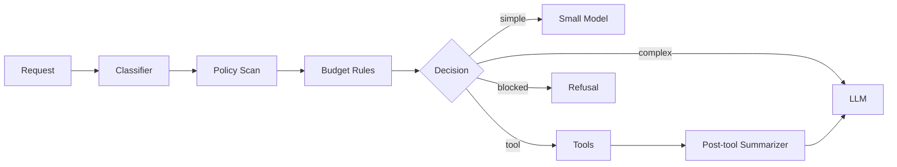
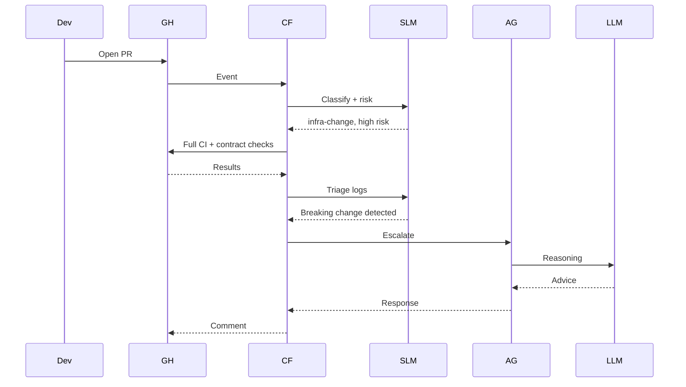

# Practical Deployment Model

This is the recommended stack for the ecosystem.

## Full Stack Architecture

## Decision Matrix

| System          | Best SLM Jobs              | Less Suitable                  |
| --------------- | -------------------------- | ------------------------------ |
| AI Gateway      | routing, screening, cost   | Nuanced synthesis              |
| Cognitive Mesh  | routing, decomposition     | Final judgment                 |
| CodeFlow        | PR triage, log analysis    | Root cause across dependencies |
| AgentKit        | tool selection, extraction | Multi-step planning            |
| PhoenixRooivalk | summaries, alerts          | Sole threat authority          |
| Mystira         | safety, continuity         | Rich narrative                 |

## Practical Gateway Flow

## End-to-End Example

A developer opens a PR that changes Terraform, GitHub Actions, and an OpenAPI spec:

SLMs handle repetitive triage; LLMs solve the hard part.
