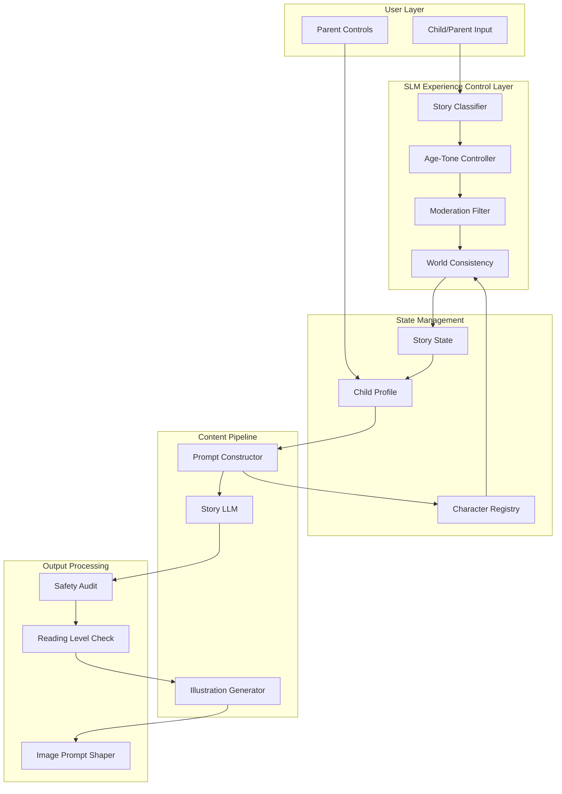
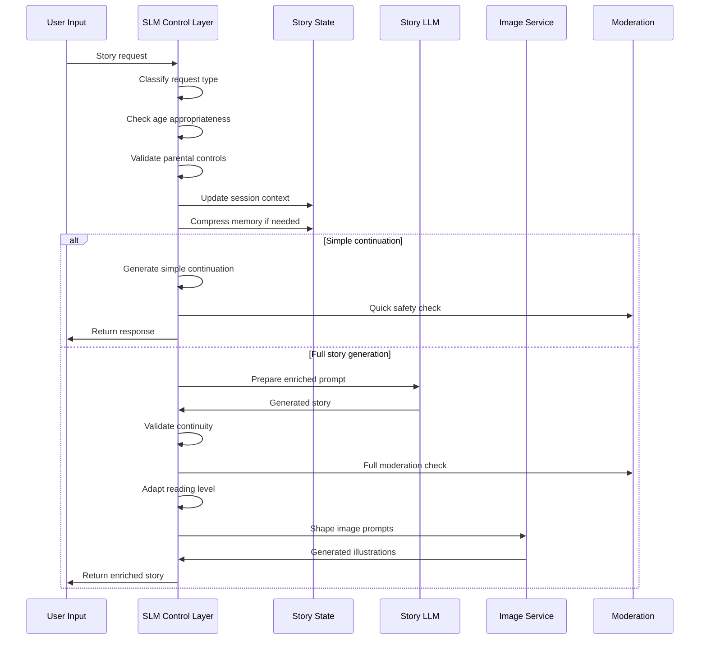
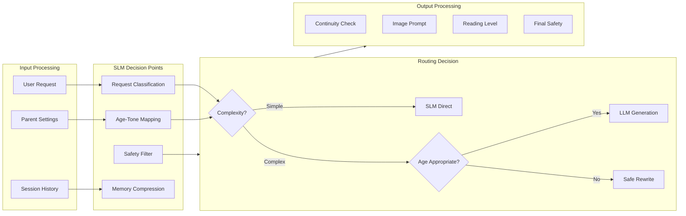
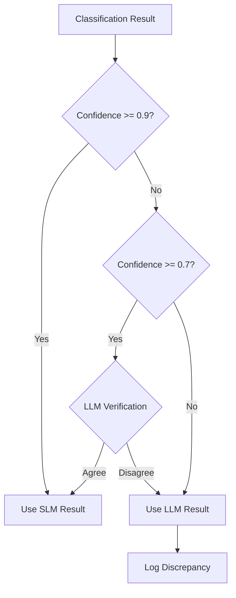
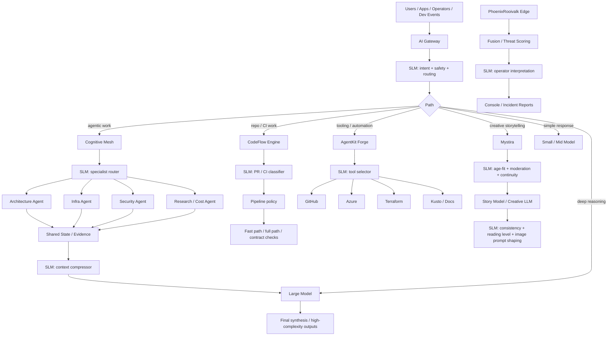

# Mystira

Mystira is an interactive story generation system for children. The SLM serves as a **content-shaping, moderation, personalization, and cost-control layer** around story generation and interactive experience flows.

## Architecture Overview



## Detailed Data Flow



## SLM as Experience Orchestrator

The SLM sits between:

1. **User input** — Classification, safety pre-check, parental control validation
2. **Story state / profile state** — Memory compression, continuity tracking
3. **Generation pipeline** — Prompt enrichment, context window management
4. **Illustration / asset prompts** — Style consistency, character adherence
5. **Moderation / age-appropriateness checks** — Multi-layer safety filtering



## Best SLM Use Cases

### 1. Story Request Classification

Determine request type:

```json
{
  "story_type": "bedtime|learning|adventure|interactive|customization|continuation|image",
  "age_range": "3-5|5-8|8-10|10-12",
  "is_interactive": true,
  "continuation": true,
  "needs_images": true,
  "curriculum_tags": ["kindness", "sharing", "animals"],
  "estimated_complexity": "low|medium|high"
}
```

### 2. Age and Tone Control

Enforce cheaply:

```json
{
  "reading_level": "easy|moderate|advanced",
  "sentence_length": "short|medium|long",
  "emotional_tone": "calm|exciting|gentle|funny",
  "safe_themes": true,
  "lesson_alignment": ["kindness", "courage"],
  "content_rating": "G|PG",
  "prohibited_elements": []
}
```

### 3. Moderation and Safe Rewriting

Catch or rewrite:

- Frightening content
- Inappropriate content
- Emotionally unsuitable scenes
- Unsafe user prompts
- Age-inappropriate vocabulary

```json
{
  "flagged": false,
  "rewritten": null,
  "content_rating": "safe|caution|blocked",
  "age_appropriate": true,
  "concerns": [],
  "rewrite_suggestions": []
}
```

### 4. Session Memory Compression

Keep only essential state:

```json
{
  "session_id": "abc123",
  "active_characters": ["Luna", "Bear"],
  "current_quest": "find_moon",
  "tone_constraints": "gentle_adventure",
  "age_band": "3-5",
  "plot_anchors": ["discovered_moon_stone", "met_starlight_friend"],
  "character_states": {
    "Luna": { "mood": "curious", "location": "forest_edge" },
    "Bear": { "mood": "helpful", "location": "forest_edge" }
  },
  "reader_preferences": { "likes": ["animals", "stars"], "dislikes": ["scary"] }
}
```

### 5. Character and World Consistency

Validate:

- Names remain consistent
- World rules not violated
- Prior events respected
- Visual prompts align with canon

```json
{
  "valid": true,
  "inconsistencies": [],
  "suggested_corrections": [],
  "world_rules_violated": [],
  "character_continuity_ok": true
}
```

### 6. Illustration Prompt Shaping

Convert story scene to constrained image prompts:

```json
{
  "prompt": "Luna the fox and Bear walking through moonlit forest, children's book style, soft colors, no scary elements",
  "style": "children_book",
  "style_params": {
    "illustration_type": "watercolor",
    "color_palette": "warm",
    "lighting": "soft_moonlight"
  },
  "character_refs": ["luna", "bear"],
  "safety_check": "passed",
  "age_appropriate": true,
  "brand_compliant": true
}
```

## Implementation

### Story Classification

```python
async def classify_story_request(
    user_input: str,
    session: Session,
    profile: ChildProfile
) -> StoryClassification:
    prompt = f"""Classify this story request:

User input: {user_input}
Session history: {session.summary}
Child age band: {profile.age_band}
Parent settings: {profile.parent_controls}

Output as JSON with fields:
- story_type: bedtime|learning|adventure|interactive|customization|continuation|image
- age_range: target age range
- is_interactive: boolean
- needs_images: boolean
- curriculum_tags: array of educational tags
- complexity: low|medium|high"""

    return await slm_completion(prompt, schema=StoryClassification)
```

### Age and Tone Control

```python
async def enforce_age_tone(
    content: str,
    profile: ChildProfile
) -> ControlledContent:
    prompt = f"""Adapt content for age group:

Content: {content[:1000]}
Age band: {profile.age_band}
Profile preferences: {profile.preferences}
Parent tone settings: {profile.parent_tone_settings}

Output as JSON:
- adapted_content: rewritten content
- reading_level: easy|moderate|advanced
- safety_flag: boolean
- concerns: array of any issues"""

    return await slm_completion(prompt, schema=ControlledContent)
```

### Safe Rewriting

```python
async def safe_rewrite(content: str, age_band: str) -> RewriteResult:
    prompt = f"""Rewrite for safety:

Content: {content[:2000]}
Age band: {age_band}

If content is safe: return unchanged with "safe" status.
If content needs rewriting: return rewritten version with reason.
If content is unsafe: return blocked with specific reason.

Output as JSON:
- status: safe|rewritten|blocked
- original: original content
- result: content after rewrite (if applicable)
- reason: explanation"""

    return await slm_completion(prompt, schema=RewriteResult)
```

### Memory Compression

```python
async def compress_session(session: Session) -> CompressedSession:
    prompt = f"""Compress session memory for story continuity:

Current session messages: {session.messages[-20:]}
Active characters: {session.characters}
Current plot state: {session.plot_state}

Output as JSON:
- summary: 2-3 sentence story summary
- active_characters: array of character names with key traits
- current_quest: current story goal or "none"
- plot_anchors: array of key events that must be remembered
- tone_constraints: current tone settings
- age_band: current age target"""

    return await slm_completion(prompt, schema=CompressedSession)
```

### Illustration Prompt Shaping

```python
async def shape_image_prompt(
    scene: StoryScene,
    characters: list[Character],
    brand_guidelines: BrandGuidelines
) -> ImagePrompt:
    prompt = f"""Create child-safe, brand-aligned image prompt:

Scene: {scene.description}
Characters: {format_characters(characters)}
Story tone: {scene.tone}
Brand style: {brand_guidelines.style}

Output as JSON:
- prompt: complete image generation prompt
- style: illustration style
- style_params: detailed style parameters
- character_refs: references to character assets
- safety_check: passed|needs_review|failed
- age_appropriate: boolean
- brand_compliant: boolean"""

    return await slm_completion(prompt, schema=ImagePrompt)
```

## Implementation Matrix

### SLM Endpoints

| Function             | Endpoint        | Model      | Latency Target |
| -------------------- | --------------- | ---------- | -------------- |
| Story Classification | `/classify`     | Phi-3 Mini | <100ms         |
| Age-Tone Control     | `/age-tone`     | Phi-3 Mini | <100ms         |
| Safe Rewrite         | `/safewrite`    | Llama 3 8B | <200ms         |
| Memory Compression   | `/compress`     | Phi-3 Mini | <100ms         |
| Consistency Check    | `/validate`     | Phi-3 Mini | <100ms         |
| Image Prompt         | `/image-prompt` | Phi-3 Mini | <100ms         |

### Contract Shapes

```typescript
interface StoryClassification {
  story_type: StoryType;
  age_range: AgeRange;
  is_interactive: boolean;
  continuation: boolean;
  needs_images: boolean;
  curriculum_tags: string[];
  complexity: Complexity;
  confidence: number;
}

interface ControlledContent {
  adapted_content: string;
  reading_level: ReadingLevel;
  safety_flag: boolean;
  concerns: string[];
  confidence: number;
}

interface CompressedSession {
  summary: string;
  active_characters: CharacterSummary[];
  current_quest: string | null;
  plot_anchors: string[];
  tone_constraints: ToneConstraints;
  age_band: AgeBand;
}

interface ImagePrompt {
  prompt: string;
  style: IllustrationStyle;
  style_params: StyleParams;
  character_refs: string[];
  safety_check: SafetyStatus;
  age_appropriate: boolean;
  brand_compliant: boolean;
}
```

### Telemetry Fields

| Field               | Type    | Description                    |
| ------------------- | ------- | ------------------------------ |
| `request_id`        | string  | Unique request identifier      |
| `session_id`        | string  | Story session identifier       |
| `timestamp`         | ISO8601 | Request timestamp              |
| `slm_model`         | string  | SLM model used                 |
| `function`          | string  | Classification function called |
| `latency_ms`        | number  | SLM processing time            |
| `confidence`        | number  | Model confidence score         |
| `routed_to_llm`     | boolean | Whether LLM was invoked        |
| `age_band`          | string  | Target age range               |
| `story_type`        | string  | Classified story type          |
| `safety_flagged`    | boolean | Content was flagged            |
| `content_rewritten` | boolean | Content was rewritten          |
| `tokens_used`       | number  | Total tokens consumed          |
| `cost_usd`          | number  | Estimated cost                 |

### Fallback Rules

| Condition                   | Action                             |
| --------------------------- | ---------------------------------- |
| SLM confidence < 0.7        | Escalate to LLM for classification |
| SLM timeout                 | Use deterministic rules fallback   |
| Moderation flag = "blocked" | Return safe error to user          |
| Age band mismatch           | Enforce age-appropriate rewrite    |
| Consistency check fails     | Notify, allow LLM override         |
| Image prompt fails safety   | Use default safe prompt            |

### Confidence Thresholds Flowchart



## Tradeoffs

| Pros                                     | Cons                                                  |
| ---------------------------------------- | ----------------------------------------------------- |
| Lowers cost for interactive sessions     | SLMs are weaker for rich narrative creativity         |
| Improves safety and consistency          | Overuse can make stories feel templated               |
| Helps maintain story canon               | Compression may lose subtle emotional continuity      |
| Enables scalable personalization         | Moderation can become too restrictive if tuned poorly |
| Reduces unnecessary LLM for simple steps | Image prompts may lack artistic nuance                |

## Correct Role

| Use SLM For     | Use LLM For                 |
| --------------- | --------------------------- |
| Preparation     | Rich storytelling           |
| Guardrails      | Emotionally nuanced scenes  |
| Continuity      | Narrative synthesis         |
| Personalization | Creative expansions         |
| Prompt shaping  | Final polished storytelling |

## Combined Cross-System Architecture



## Platform Comparison

| Platform        | Best SLM Role                                   | Should SLM be Primary?    | Escalate to LLM When                             |
| --------------- | ----------------------------------------------- | ------------------------- | ------------------------------------------------ |
| AI Gateway      | routing, safety, cost control                   | **yes**                   | ambiguity, complex reasoning                     |
| Cognitive Mesh  | agent routing, decomposition, compression       | **yes**                   | cross-agent synthesis needed                     |
| CodeFlow Engine | PR/CI triage, failure summaries                 | **yes**                   | root cause requires deep analysis                |
| AgentKit Forge  | tool selection, memory shaping                  | **yes**                   | planning becomes ambiguous or multi-step         |
| PhoenixRooivalk | operator summaries, reports                     | **no**                    | strategic analysis or long-form reporting        |
| **Mystira**     | moderation, age-fit, continuity, prompt shaping | **yes** for control layer | rich storytelling, emotionally nuanced narrative |

## Key Concerns

| Concern             | Strategy                                                     |
| ------------------- | ------------------------------------------------------------ |
| Safety              | SLM pre-filter + LLM post-filter + deterministic rules       |
| Age-appropriateness | Hard rules for age bands + SLM adaptation                    |
| Story continuity    | SLM validates consistency with plot anchors                  |
| Cost                | Route simple steps through SLM; LLM only for rich generation |
| Creativity          | Reserve LLM for emotionally nuanced storytelling             |
| Parental controls   | Deterministic rules + SLM suggestion refinement              |
| Brand consistency   | SLM enforces brand guidelines in image prompts               |

## Canonical Principle for Mystira

> **Use SLMs to make stories safe, consistent, and affordable.**
> **Use LLMs to make them magical.**

## Implementation Checklist

- [ ] Add story request classification endpoint
- [ ] Implement age and tone control pipeline
- [ ] Add moderation and safe rewriting
- [ ] Implement session memory compression
- [ ] Add character/world consistency validation
- [ ] Implement illustration prompt shaping
- [ ] Set up cost tracking per session type
- [ ] Configure confidence threshold cascades
- [ ] Add parental controls integration
- [ ] Implement brand guidelines enforcement
- [ ] Add telemetry and observability
- [ ] Set up fallback deterministic rules
